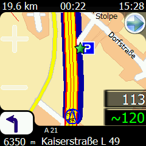
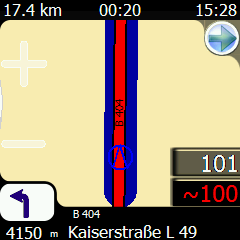
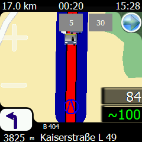
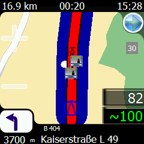
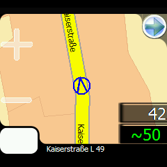
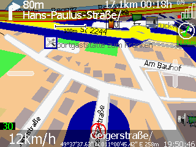
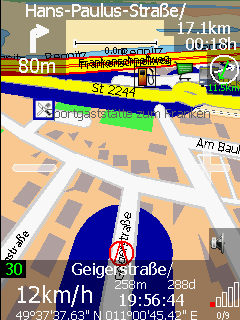

.. _osd_layouts:

OSD Layouts
===========

This page is intended for users to display the OSD layouts that they
have designed and provide a way to share those layouts to other users.
Feel free to add your own completed layout to this page. As the number
of layouts expands this page will be broken into several sub sections
for each device.

Note: For an explanation of how to modify the OSD layouts reference
:doc:`OSD </user/configuration/OSD>` section. Many of the layouts on this page were borrowed
from the examples on that page.

Notes
-----

-  If you would like instructions on how to modify OSD layouts you can
   refer to the :doc:`OSD page </user/configuration/OSD>`.

-  If you would like to share your own layout please let us know via the
   channels listed on the :doc:`Contacts </user/community/contacts>` page.

Tip
---

To make configuring Navit simpler it is recommended that you copy the
navit.xml from "/usr/share/navit" to your home directory
"/home/user/.navit" where "user" is the username you log into your
computer with. Then to make changing OSD layouts, you can replace the
OSD entries in navit.xml with:

Then create a new file navitOSD.xml in which you place all the OSD
items. This means you can create and share layouts by providing just the
navitOSD.xml file and people can drop them into place without having to
hand edit their navit.xml files. The same trick will work for any subset
part of the navit.xml file. Remember to begin your file with and end it
with , otherwise Navit won't be able to parse it properly.

This trick was contributed by Daniel Would.

.. _layout-scaler:

Layout scaler for different screen sizes
----------------------------------------

This is a small perl script scale.pl that makes use of imagemagick
(convert) to quickly convert any OSD layout for a different screen
resolution. It is tested for nibbler01 and Mineque003 and assumes to be
run against a specific skin and not against the navit.xml (might work
too...)

Known issues:

-  svg images are displayed in fixed size by navit (might be fixed soon)
-  some elements don't scale that nicely, you might want to edit the
   resulting xml for one or two fontsizes.
-  no proper xml parsing, just regexp stuff

Features:

-  converts xml and png in one go
-  does not touch original files

Usage: Create scaled layout with:

.. code:: console

   ./scale.pl 50 ~/.navit/nibbler01/

then include the -scaled-XX xml file instead of the original.

Nokia NSeries Tablets
---------------------

For tips and advice on Nokia layouts please reference the
NSeries layouts below.

NSeries Layout 1
~~~~~~~~~~~~~~~~

.. figure:: Screenshot-2009-02-06-21-59-28.png
   :alt: Screenshot-2009-02-06-21-59-28.png
   :width: 400px

   Screenshot-2009-02-06-21-59-28.png

.. code:: xml

   <osd enabled="yes" type="text" label="${vehicle.position_speed}" x="5" y="46" font_size="800" w="200" h="55" align="4" background_color="#1b0877cc"/>
   <osd enabled="yes" type="text" label="ETA: ${navigation.item.destination_time[arrival]}" x="-220" y="46" font_size="500" w="215" h="40" align="4" background_color="#1b0877cc"/>
   <osd enabled="yes" type="text" label="Left to Go" x="-175" y="87" font_size="400" w="170" h="40" align="4" background_color="#1b0877cc"/>
   <osd enabled="yes" type="text" label="${navigation.item.destination_length[named]}" x="-200" y="128" font_size="550" w="195" h="40" align="4" background_color="#1b0877cc"/>
   <osd enabled="yes" type="text" label="${navigation.item.destination_time[remaining]}" x="-200" y="169" font_size="550" w="195" h="40" align="4" background_color="#1b0877cc"/>
   <osd enabled="yes" type="text" label="In ${navigation.item[1].length[named]} " x="-320" y="-86" font_size="650" w="235" h="45" align="4" background_color="#1b0877cc"/>
   <osd enabled="yes" type="navigation_next_turn" x="-85" y="-106" font_size="500" w="80" h="65" background_color="#1b0877cc"/>
   <osd enabled="yes" type="text" label="onto ${navigation.item[1].street_name}" x="-555" y="-40" font_size="550" w="550" h="35" align="4" background_color="#1b0877cc"/>
   <osd enabled="yes" type="text" label="${navigation.item.street_name} Max:${tracking.item.route_speed}" x="5" y="5" align="0" background_color="#1b0877cc" font_size="550" w="790" h="40"/>
   <osd enabled="yes" type="gps_status" x="5" y="101" w="50" h="40" background_color="#1b0877cc"/>
   <osd enabled="yes"  type="button" x="5" y="-120" command="zoom_in()" src="gui_zoom_in.png"/>
   <osd enabled="yes"  type="button" x="60" y="-60" command="zoom_out()" src="gui_zoom_out.png"/>
   <osd enabled="yes"  type="button" x="5" y="-60" command="gui.fullscreen=1" src="gui_fullscreen.png"/>
   <osd enabled="no" type="speed_warner" x="-60" y="180" w="60" h="60"/>
   <osd enabled="no" type="button" x="0" y="0" command="gui_internal_menu" src="menu.xpm"/>

NSeries Layout 2
~~~~~~~~~~~~~~~~

.. figure:: osd2.png
   :alt: osd2.png
   :width: 400px

   osd2.png

.. code:: xml

   <osd enabled="yes" type="compass" x="5" y="5" font_size="250" w="60" h="62" background_color="#48852faf"/>
   <osd enabled="yes" type="gps_status" x="70" y="5" w="50" h="40" background_color="#48852faf"/>
   <osd enabled="yes" type="text" label="${vehicle.position_sats_signal}/${vehicle.position_qual}" x="70" y="45" font_size="300" w="50" h="22" align="0" background_color="#48852faf"/>
   <osd enabled="yes" type="text" label="${vehicle.position_speed}" x="5" y="72" font_size="400" w="115" h="35" align="4" background_color="#48852faf"/>
   <osd enabled="yes" type="text" label="ETA: ${navigation.item.destination_time[arrival]}" x="5" y="-220" font_size="400" w="170" h="30" align="4" background_color="#1a6ad780"/>
   <osd enabled="yes" type="text" label="Left to Go" x="5" y="-185" font_size="400" w="170" h="30" align="4" background_color="#1a6ad780"/>
   <osd enabled="yes" type="text" label="${navigation.item.destination_length[named]}" x="5" y="-150" font_size="400" w="170" h="30" align="4" background_color="#1a6ad780"/>
   <osd enabled="yes" type="text" label="${navigation.item.destination_time[remaining]}" x="5" y="-115" font_size="400" w="170" h="30" align="4" background_color="#1a6ad780"/>
   <osd enabled="yes" type="text" label="In ${navigation.item[1].length[named]} " x="5" y="-40" font_size="500" w="235" h="35" align="4" background_color="#000000c8"/>
   <osd enabled="yes" type="navigation_next_turn" x="245" y="-45" font_size="500" w="60" h="40" background_color="#000000c8"/>
   <osd enabled="yes" type="text" label="onto ${navigation.item[1].street_name}" x="310" y="-40" font_size="500" w="485" h="35" align="4" background_color="#000000c8"/>
   <osd enabled="yes" type="text" label="${navigation.item.street_name}" x="150" y="5"  font_size="500" w="500" h="35" align="0" background_color="#ff71004b"/>
   <osd enabled="yes" type="button" x="-60" y="0" command="zoom_in()" src="gui_zoom_in.png"/>
   <osd enabled="yes" type="toggle_announcer" x="-65" y="95" w="60" h="60" background_color="#1a6ad700"/>
   <osd enabled="yes" type="button" x="-60" y="200" command="gui.fullscreen=1" src="gui_fullscreen.png"/>
   <osd enabled="yes" type="button" x="-60" y="-105" command="zoom_out()" src="gui_zoom_out.png"/>

NSeries Layout 3
~~~~~~~~~~~~~~~~

.. figure:: OSDSimple.png
   :alt: OSDSimple.png
   :width: 400px

   OSDSimple.png

.. code:: xml

   <osd enabled="yes" type="compass" x="-110" y="-60" font_size="250" w="60" h="60" background_color="#000000c8"/>
   <osd enabled="yes" type="gps_status" x="-50" y="-60" w="50" h="40" background_color="#000000c8"/>
   <osd enabled="yes" type="text" label="${vehicle.position_sats_signal}/${vehicle.position_qual}" x="-50" y="-20" font_size="250" w="50" h="20" align="0" background_color="#000000c8"/>
   <osd enabled="yes" type="text" label="${vehicle.position_speed}" x="0" y="-60" font_size="400" w="110" h="60" align="4" background_color="#000000c8"/>
   <osd enabled="yes" type="text" label="ETA: ${navigation.item.destination_time[arrival]}" x="110" y="-30" font_size="300" w="170" h="30" align="4" background_color="#000000c8"/>
   <osd enabled="yes" type="text" label="${navigation.item.destination_length[named]}" x="280" y="-30" font_size="300" w="170" h="30" align="4" background_color="#000000c8"/>
   <osd enabled="yes" type="text" label="${navigation.item.destination_time[remaining]}" x="450" y="-30" font_size="300" w="240" h="30" align="4" background_color="#000000c8"/>
   <osd enabled="yes" type="text" label="In ${navigation.item[1].length[named]} " x="0" y="0" font_size="500" w="245" h="40" align="4" background_color="#000000c8"/>
   <osd enabled="yes" type="navigation_next_turn" x="245" y="0" font_size="500" w="60" h="40" background_color="#000000c8" icon_src="$NAVIT_SHAREDIR/xpm/%s_wh_48_48.png" />
   <osd enabled="yes" type="text" label="Onto ${navigation.item[1].street_name}" x="305" y="0" font_size="500" w="495" h="40" align="4" background_color="#000000c8"/>
   <osd enabled="yes" type="text" label="${navigation.item.street_name}" x="110" y="-60"  font_size="500" w="580" h="30" align="0" background_color="#000000c8"/>
   <osd enabled="yes" type="button" x="-60" y="50" command="zoom_in()" src="gui_zoom_in.png"/>
   <osd enabled="yes" type="toggle_announcer" x="-65" y="130" w="60" h="60" background_color="#1a6ad700"/>
   <osd enabled="yes" type="button" x="-60" y="220" command="gui.fullscreen=1" src="gui_fullscreen.png"/>
   <osd enabled="yes" type="button" x="-60" y="-120" command="zoom_out()" src="gui_zoom_out.png"/>

NSeries Layout 4
~~~~~~~~~~~~~~~~~~

Tested on N900 but should work on any display, as it works nicely on my
laptop as well. See the NSeries layouts above for further configuration.

.. figure:: N900-OSD.png
   :alt: N900-OSD.png
   :width: 400px

   N900-OSD.png

.. code:: xml

   <!-- Upper left corneriand button -->
   <!-- Distance to and type of the next turn -->
   <osd enabled="yes" type="text" label="In ${navigation.item[1].length[named]} " x="0" y="0" font_size="500" w="200" h="40" align="4" background_color="#000000c8"/>
   <osd enabled="yes" type="navigation_next_turn" x="200" y="0" font_size="500" w="60" h="40" background_color="#000000c8" icon_src="$NAVIT_SHAREDIR/xpm/%s_wh_48_48.png" />
   <!-- ETA  -->
   <osd enabled="yes" type="text" label="ETA:" x="0" y="40" font_size="200" w="35" h="40" align="4" background_color="#000000c8"/>
   <osd enabled="yes" type="text" label="${navigation.item.destination_time[arrival]}" x="35" y="40" font_size="500" w="150" h="40" align="4" background_color="#000000c8"/>
   <!-- Distance to destination -->
   <osd enabled="yes" type="text" label="${navigation.item.destination_length[named]}" x="0" y="80" font_size="500" w="130" h="40" align="4" background_color="#000000c8"/>
   <!-- Time to destination -->
   <osd enabled="yes" type="text" label="${navigation.item.destination_time[remaining]}" x="0" y="120" font_size="500" w="110" h="40" align="4" background_color="#000000c8"/>
   <!--Scale-->
   <osd enabled="yes" x="260" y="0" w="200" h="60" font_size="500" type="scale"/>
   <!--Quit Navit-->
   <osd enabled="yes" type="button" x="0" y="160" command="gui.quit()" src="gui_quit_64_64.png"/>
   <!-- Upper right corner and buttons -->
   <!-- Current time -->
   <osd enabled="yes" type="text" label="${vehicle.position_time_iso8601[local;%H:%M]}" x="-110" y="0" font_size="500" w="110" h="40" align="4" background_color="#000000c8"/>
   <!-- Zoom in -->
   <osd enabled="yes" type="button" x="-96" y="40" command="zoom_in()" src="gui_zoom_in_96_96.png"/>
   <!-- Menu -->
   <osd enabled="yes" type="button" x="-206" y="0" command="gui.menu()" src="gui_menu_96_96.png"/>
   <!-- Lower left corner and buttons -->
   <!-- Full screen -->
   <osd name="my_fullscreen_status" enabled="yes" type="button" x="0" y="-156" src="/opt/navit/share/navit/xpm/gui_leave_fullscreen_96_96.png" command='gui.fullscreen=!gui.fullscreen;osd[@name=="my_fullscreen_status"].src= gui.fullscreen==0?"/opt/navit/share/navit/xpm/gui_fullscreen_96_96.png":"/opt/navit/share/navit/xpm/gui_leave_fullscreen_96_96.png"'/>
   <!-- GPS speed -->
   <osd enabled="yes" type="text" label="${vehicle.position_speed[value]}" x="0" y="-60" font_size="1000" w="170" h="60" align="4" background_color="#000000c8"/>
   <!-- Toggle speech -->
   <osd name="my_speech_status" enabled="yes" type="button" src="gui_sound_96_96.png" x="170" y="-96" command='speech.active=!speech.active;osd[@name=="my_speech_status"].src =speech.active==0?"gui_sound_off_96_96.png":"gui_sound_96_96.png"'/>
   <!-- Lower right corner and buttons -->
   <!-- Zoom out -->
   <osd enabled="yes" type="button" x="-96" y="-192" command="zoom_out()" src="gui_zoom_out_96_96.png"/>
   <!-- Switch 3D and 2D, orientation north, autozoom and when switching to 2D, zooms out to whole route -->
   <osd enabled="yes" type="button" x="-252" y="-96" command="orientation=orientation==0?-1:0;pitch=pitch==0?30:0;autozoom_active=autozoom_active==0?1:0;pitch==0?zoom_to_route()" src="gui_map_92_92.png"/>
   <!-- Compass  -->
   <osd enabled="yes" type="compass" x="-156" y="-96" font_size="350" w="96" h="96" background_color="#000000c8"/>
   <!-- GPS status -->
   <osd enabled="yes" type="gps_status" x="-60" y="-96" w="60" h="64" background_color="#000000c8"/>
   <!-- Satellites -->
   <osd enabled="yes" type="text" label="${vehicle.position_sats_signal}/${vehicle.position_qual}" x="-60" y="-32" font_size="350" w="60" h="32" align="0" background_color="#000000c8"/>
   <!-- Name of the current and next street -->
   <!--osd enabled="yes" type="text" label="Onto ${navigation.item[1].street_name}" x="305" y="0" font_size="500" w="495" h="40" align="4" background_color="#000000c8"/-->
   <!--osd enabled="yes" type="text" label="${navigation.item.street_name}" x="180" y="-60" font_size="500" w="580" h="30" align="0" background_color="#000000c8"/-->

Neo FreeRunner
--------------

FreeRunner Layout 1
~~~~~~~~~~~~~~~~~~~

.. figure:: FR-3D-OSD2.png
   :alt: FR-3D-OSD2.png
   :width: 250px

   FR-3D-OSD2.png

.. code:: xml

   <gui type="internal" font_size="350" icon_xs="60" icon_s="70" icon_l="70"/>
   <osd enabled="yes" type="text" label="${navigation.item.street_name} ${navigation.item[1].street_name_systematic}" x="0" y="0" w="425" h="30" align="0" background_color="#000000cc" font_size="300" />
   <osd enabled="yes" type="gps_status" x="425" y="0" w="65" h="30" align="0" background_color="#000000cc" font_size="300" />
   <osd enabled="yes" type="text" label="ETA:${navigation.item.destination_time[arrival]}" x="0" y="-25" w="160" h="25" align="4" background_color="#000000cc" font_size="350" />
   <osd enabled="yes" type="text" label="TL:${navigation.item.destination_time[remaining]}" x="160" y="-25" w="160" h="25" align="4" background_color="#000000cc" font_size="350" />
   <osd enabled="yes" type="text" label="Dist:${navigation.item.destination_length[named]}" x="320" y="-25" w="160" h="25" align="4" background_color="#000000cc" font_size="350" />
   <osd enabled="yes" type="text" label="${vehicle.position_speed} / ${tracking.item.route_speed}" x="0" y="30" w="180" h="25" align="4" background_color="#000000cc" font_size="280"/>
   <osd enabled="yes" type="navigation_next_turn" x="320" y="30"  w="160" h="60"  background_color="#000000cc" />
   <osd enabled="yes" type="text" label="${navigation.item[1].length[named]}" x="320" y="90" w="160" h="40" align="" background_color="#000000cc" font_size="450"/>
   <osd enabled="yes" type="button" x="-96" y="-106" command="zoom_in()" src="zoom_in.xpm"/>
   <osd enabled="yes" type="button" x="0" y="-106" command="zoom_out()" src="zoom_out.xpm"/>

FreeRunner Layout 2
~~~~~~~~~~~~~~~~~~~

.. figure:: Navit-FR-OSD-POI-Firenze.png
   :alt: Navit-FR-OSD-POI-Firenze.png
   :width: 250px

   Navit-FR-OSD-POI-Firenze.png

.. code:: xml

   <osd enabled="yes" type="text" label="${navigation.item.street_name} ${navigation.item[1].street_name_systematic}" x="0" y="0" w="480" h="30" align="0" background_color="#000000cc" font_size="300" />
   <osd enabled="yes" type="gps_status" x="430" y="0" w="65" h="30" align="0" background_color="#000000cc" font_size="300" />
   <osd enabled="yes" type="navigation_next_turn" x="165" y="30" w="150" h="60"  background_color="#000000cc" />
   <osd enabled="yes" type="text" label="${navigation.item[1].length[named]}" x="165" y="90" w="150" h="40" align="" background_color="#000000cc" font_size="450"/>
   <osd enabled="yes" type="button" x="-55" y="-90" command="zoom_in()" src="gui_zoom_in.svg"/>
   <osd enabled="yes" type="button" x="5" y="-90" command="zoom_out()" src="gui_zoom_out.svg"/>
   <osd enabled="yes" type="text" label="${vehicle.position_speed}" x="120" y="-50" w="240" h="25" align="0" background_color="#000000cc" font_size="280"/>
   <osd enabled="yes" type="text" label="ETA:${navigation.item.destination_time[arrival]}" x="0" y="-25" w="160" h="25" align="4" background_color="#000000cc" font_size="350" />
   <osd enabled="yes" type="text" label="TL:${navigation.item.destination_time[remaining]}" x="160" y="-25" w="160" h="25" align="4" background_color="#000000cc" font_size="350" />
   <osd enabled="yes" type="text" label="Dist:${navigation.item.destination_length[named]}" x="320" y="-25" w="160" h="25" align="4" background_color="#000000cc" font_size="350" />

FreeRunner Layout 3
~~~~~~~~~~~~~~~~~~~

.. figure:: Navit-FR-OSD-POI-Firenze2.png
   :alt: Navit-FR-OSD-POI-Firenze2.png
   :width: 250px

   Navit-FR-OSD-POI-Firenze2.png

.. code:: xml

   <osd enabled="yes" type="text" label="${navigation.item.street_name} ${navigation.item[1].street_name_systematic}" x="0" y="0" w="480" h="30" align="0" background_color="#000000cc" font_size="300" />
   <osd enabled="yes" type="gps_status" x="430" y="0" w="65" h="30" align="0" background_color="#000000cc" font_size="300" />
   <osd enabled="yes" type="compass" align="0" font_size="350" x="0" y="30" w="150" h="100"  background_color="#000000cc" />
   <osd enabled="yes" type="navigation_next_turn" x="-150" y="30" w="150" h="60"  background_color="#000000cc" />
   <osd enabled="yes" type="text" label="${navigation.item[1].length[named]}" x="-150" y="90" w="150" h="40" align="0" background_color="#000000cc" font_size="450"/>
   <osd enabled="yes" type="button" x="-55" y="-90" command="zoom_in()" src="gui_zoom_in.svg"/>
   <osd enabled="yes" type="button" x="5" y="-90" command="zoom_out()" src="gui_zoom_out.svg"/>
   <osd enabled="yes" type="text" label="${vehicle.position_speed}" x="120" y="-50" w="240" h="25" align="0" background_color="#000000cc" font_size="280"/>
   <osd enabled="yes" type="text" label="ETA:${navigation.item.destination_time[arrival]}" x="0" y="-25" w="160" h="25" align="4" background_color="#000000cc" font_size="350" />
   <osd enabled="yes" type="text" label="TL:${navigation.item.destination_time[remaining]}" x="160" y="-25" w="160" h="25" align="4" background_color="#000000cc" font_size="350" />
   <osd enabled="yes" type="text" label="Dist:${navigation.item.destination_length[named]}" x="320" y="-25" w="160" h="25" align="4" background_color="#000000cc" font_size="350" />

FreeRunner Layout 4
~~~~~~~~~~~~~~~~~~~

.. code:: xml

   <osd enabled="yes" type="text" label="Currently On ${navigation.item.street_name} ${navigation.item[1].street_name_systematic}" x="0" y="0" w="590" h="30" align="4" />
   <osd enabled="yes" type="gps_status" x="-50" y="0" w="50" h="30" align="8" font_size="300" />
   <osd enabled="yes" type="text" label="ETA:${navigation.item.destination_time[arrival]}" x="0" y="-25" w="160" h="25" align="4" font_size="350" />
   <osd enabled="yes" type="text" label="Dist:${navigation.item.destination_length[named]}" x="160" y="-25" w="160" h="25" align="4" font_size="350"/>
   <osd enabled="yes" type="text" label="${navigation.item[1].length[named]}" x="-160" y="-30" w="160" h="30" font_size="500"/>
   <osd enabled="yes" type="navigation_next_turn" x="-160" y="-126" w="160" h="96"  icon_src="$NAVIT_SHAREDIR/xpm/%s_wh_96_96.png"/>
   <osd enabled="yes" type="button" x="-96" y="30" command="gui.fullscreen=!gui.fullscreen" src="toggle_fullscreen.xpm"/>
   <osd enabled="yes" type="button" x="-96" y="126" command="zoom_in()" src="zoom_in.xpm"/>
   <osd enabled="yes" type="button" x="-96" y="222" command="zoom_out()" src="zoom_out.xpm"/>
   <osd enabled="yes" type="toggle_announcer" x="0" y="30" w="96" h="96" icon_src="$NAVIT_SHAREDIR/xpm/%s_96_96.png" />

neo-cs
~~~~~~

About the skin
^^^^^^^^^^^^^^

This skin was developed for the relatvely small screen (in comparison to
todays smartphones) of the neo freerunner featuring a resolution of 480
x 640 pixel. I haven't tested the more recent version only on the gta04
hardware regarding the performance. The skin should work in portrait and
landscape mode as well. Since the svg files are included, the skin is
fairly easy to adjust to larger screens. Please put modified versions of
the skin back on this page.

Features
^^^^^^^^

-  Automatic activation of osd icons only needed if there is a gps fix.
-  Automatic switching between tracking and routing mode.
-  Display of the routing status with five icons.
-  Important options are accessible directly from the osd (see skin
   description)

Screenshots
^^^^^^^^^^^

The screenshots from the original wiki page are no longer available.
Skin description
^^^^^^^^^^^^^^^^

The osd provides a top bar, a bottom bar and several icons within the
map area:

-  **The top bar**
   where routing maneuvers are displayed.
   Tapping on the top bar toggles between fullscreen and windowed mode
-  **The in screen buttons and displays:**

   -  **Current speed** (1)
      tapping on the speed display toggles between some routing or
      tracking information and the odometer in the bottom bar (see
      below).
   -  **Current altitude** (1)
   -  **Autozoom** (1)
      a toggle between manual zooming and speed dependant automatic
      zoom.
   -  **Follow mode** (1)
      the map is either dragged by the vehcle cursor or can be moved
      around manually.
   -  **Map orientation** (1)
      toggle between a north oriented map and a map oriented by the
      travel direction.
   -  **Zoom in / out buttons.**
   -  **Routing status icon**
      tapping on the icon zooms to full route view, or to the entered
      destination.
   -  **2D / 3D toggle.**
   -  **A small scale** to estimate distances.

-  **The bottom bar**
   where the current road (if any) is displayed, a little compass (1)
   and the gps quality
   Furthermore there is a second line in the bottom bar which depends on
   the mode we're in:

   -  **Tracking mode**
      shows the position on the second line.
   -  **Routing mode**
      shows the estimated time of arrival, the distance to destination
      and the estimated remaining travel duration on the second line.
   -  **Odometer**
      when the odometer is active (see above), the second line is used
      for travel distance, travel time and average speed. Tapping on the
      odometer line will stop / resume the odometer, double tapping
      resets the odometer

1). Only visible if there is a gps fix

Download
^^^^^^^^

| You can find the latest skin im my debian repository at:
| http://ftp.architektur.tu-darmstadt.de
| Non debian user can simply browse the repository, and download the
  tarball.
| Additionally you can find my latest navit built for debian
  squeeze/wheezy there.

Installation and configuration
^^^^^^^^^^^^^^^^^^^^^^^^^^^^^^

For Debian users I can provide a Debian package, other distributions or
platforms have to unpack the tarball and put the skinfiles in the right
place. There are some things to be mentioned:

-  The skin is designed to be placed in the navit share path
   *$NAVIT_SHAREDIR* (usually */usr/share/navit*) under
   *./skins/neo-cs/*. If this isn't the case, all the icon paths has to
   be adjusted to your needs (i.e. *$HOME/.navit/skins/neo-cs/icons/*).
-  If you have to or want to install the skin manually from the tarball,
   simply place neo-cs.xml in */usr/share/navit/skins/neo-cs/* and the
   icons (you need only the png's) in
   */usr/share/navit/skins/neo-cs/icons/*, or to any other place you
   like if you modify the icon path in neo-cs.xml.
-  Include the skin somewhere in your *navit.xml* and make sure there
   are no other osd definitions:

``<xi:include href="$NAVIT_SHAREDIR/skins/neo-cs/neo-cs.xml"/>``

-  Some attribute under the *navit* tag in *navit.xml* should be set:

-  ``osd_configuration="1"`` otherwise osd elements that should be shown
   by default are not visible.
-  ``tracking="1"`` to snap on to roads.
-  ``timeout="1"`` to immediately resume the map dragging by the vehicle,
   since we have a button if we really want to look something on the map.
-  ``radius="27"`` a slightly increased distance between the vehicle cursor
   and the display edges.

-  Some attribute under the *vehicle* tag in *navit.xml* my also be set
   by default:

-  ``follow="1"`` how often the map is updated, should be on a lower level
   for gta02 i.e. "8".
-  ``lag="15"`` a practical value I tested for the gps lag (in 1/10 sec.).
-  ``follow_cursor="1"`` to enable the map following the vehicle by default.

I've put my configuration files in the tarball as they might be useful
as a starting point. The included navit.xml isn't a complete
configuration, just a skeleton in which all the stuff from the original
config file is included. I find it more convenient to have just a small
file to modify rather than to edit everywhere in the complete
configuration file. That way I have only to look for new layouts or
vehicleprofiles to include in case of a navit update.

Known issues, bugs and TODO
^^^^^^^^^^^^^^^^^^^^^^^^^^^

-  In older navit versions the routing status icon will appear in the
   internal gui. This isn't a skin bug as it is fixed in the recent svn
   versions of navit.
-  There is a slight refresh delay of the separator png's when toggling
   between odometer and the other display modes.
-  The scale should be not visible in 3D view, but it always shows up.
-  I haven't found a better way to decide if there's a gps fix than to
   watch if there are at least three satellites in use. Therefore it's
   possible that, for a period of time, the gui decides there's a fix
   when the gps actually hasn't one. If someone knows a better
   (available) way, please let me know.
-  The positioning of the odometer isn't that nice, since all the values
   (distance, time and avg. speed) can only be placed as one object.

PC Layouts
----------

Mineque's PC layouts
~~~~~~~~~~~~~~~~~~~~

| These skins fits only screens with 800px width.
| Create dir ".navit/skins/" in your home dir and unpack there skin.
| For enabling it you have to edit xml file from the archive in two
  places:

You have to change the path after ``src="..."`` to one that fits your user
dirname. And last thing, edit navit.xml: comment everything between
``<vehicle ...>`` and ``<vehicle ...>``. After that paste ``<osd ...>``
under it with the corrected path of your user dirname and chosen skin.

Mineque's OSD 001 Layout
^^^^^^^^^^^^^^^^^^^^^^^^

.. figure:: Mineque_OSD_Layout_02.jpg
   :alt: Mineque_OSD_Layout_02.jpg
   :width: 400px

   Mineque_OSD_Layout_02.jpg

Note! The following package contains two images required for this
layout:

-  `Mineque 001 <http://quanteam.pl/mineque/Mineque_001-800w.zip>`__

.. code:: xml

   <osd enabled="yes" type="text" label="Currently On ${navigation.item.street_name} ${navigation.item[1].street_name_systematic}" x="0" y="0" w="735" h="30" align="1" background_color="#a60c0f00]" font_size="300" src="gui_fullscreen.svg" />
   <osd enabled="yes" type="gps_status" x="735" y="0" w="65" h="30" align="0" background_color="#a60c0f00" font_size="300" />
   <osd enabled="yes" type="text" label="ETA:${navigation.item.destination_time[arrival]}" x="0" y="-25" w="160" h="25" align="4" background_color="#a60c0f01" font_size="350" />
   <osd enabled="yes" type="text" label="TL:${navigation.item.destination_time[remaining]}" x="160" y="-25" w="160" h="25" align="4" background_color="#a60c0f00" font_size="350" />
   <osd enabled="yes" type="text" label="Dist:${navigation.item.destination_length[named]}" x="320" y="-25" w="170" h="25" align="4" background_color="#a60c0f00" font_size="350" />
   <osd enabled="yes" type="text" label="${vehicle.position_speed} / ${tracking.item.route_speed}" x="490" y="-25" w="150" h="25" align="4" background_color="#a60c0f00" font_size="280"/>
   <osd enabled="yes" type="text" label="${navigation.item[1].length[named]}" x="640" y="-30" w="160" h="30" background_color="#a60c0f00" font_size="500"/>
   <osd enabled="yes" type="navigation_next_turn" x="640" y="-80"  w="160" h="50" background_color="#a60c0f00" />
   <osd enabled="yes" type="button" x="0" y="-85" w="800" h="85" command="" src="/home/mineque/.navit/skins/Mineque_001/M_001_01.png" />
   <osd enabled="yes" type="button" x="0" y="0" w="800" h="35" command="" src="/home/mineque/.navit/skins/Mineque_001/M_001_02.png" />
   <osd enabled="yes"  type="button" x="5" y="30" command="gui.fullscreen=1" src="gui_fullscreen.svg"/>
   <osd enabled="yes"  type="button" x="5" y="475" command="zoom_in()" src="gui_zoom_in.svg"/>
   <osd enabled="yes"  type="button" x="590" y="475" command="zoom_out()" src="gui_zoom_out.svg"/>

Mineque's OSD 003 Layout
^^^^^^^^^^^^^^^^^^^^^^^^

.. figure:: Mineque_003.jpg
   :alt: Mineque_003.jpg
   :width: 400px

   Mineque_003.jpg

Note! The following package contains two images required for this
layout:

-  `Mineque 003 <http://quanteam.pl/mineque/Mineque_003-800w.zip>`__

.. code:: xml

   <osd enabled="yes" type="text" label="Currently On ${navigation.item.street_name} ${navigation.item[1].street_name_systematic}" x="0" y="0" w="735" h="35" align="16" background_color="#a60c0f00" font_size="430" src="gui_fullscreen.svg" />
   <osd enabled="yes" type="gps_status" x="735" y="0" w="65" h="30" align="0" background_color="#a60c0f00" font_size="300" />
   <osd enabled="yes" type="text" label="ETA:${navigation.item.destination_time[arrival]}" x="50" y="-100" w="275" h="70" align="4" background_color="#a60c0f01" font_size="500" />
   <osd enabled="yes" type="text" label="TL:${navigation.item.destination_time[remaining]}" x="475" y="-100" w="275" h="70" align="4" background_color="#a60c0f00" font_size="500" />
   <osd enabled="yes" type="text" label="Dist:${navigation.item.destination_length[named]}" x="50" y="-60" w="275" h="70" align="4" background_color="#a60c0f00" font_size="500" />
   <osd enabled="yes" type="text" label="${vehicle.position_speed} / ${tracking.item.route_speed}" x="475" y="-60" w="275" h="70" align="4" background_color="#a60c0f00" font_size="500"/>
   <osd enabled="yes" type="text" label="${navigation.item[1].length[named]}" x="325" y="-40" w="150" h="40" align="0" background_color="#a60c0f00" font_size="500"/>
   <osd enabled="yes" type="navigation_next_turn" x="325" y="-135"  w="150" h="100" align="15" background_color="#a60c0f00" />
   <osd enabled="yes" type="button" x="0" y="-120" w="800" h="120" command="" src="/home/mineque/.navit/skins/Mineque_003/M_003_01.png" />
   <osd enabled="yes" type="button" x="0" y="0" w="800" h="35" command="" src="/home/mineque/.navit/skins/Mineque_003/M_003_02.png" />
   <osd enabled="yes"  type="button" x="5" y="35" command="gui.fullscreen=1" src="gui_fullscreen.svg"/>
   <osd enabled="no" type="button" x="300" y="100" command="gui.menu()" src="menu.xpm"/>
   <osd enabled="yes"  type="button" x="5" y="475" command="zoom_in()" src="gui_zoom_in.svg"/>
   <osd enabled="yes"  type="button" x="-53" y="475" command="zoom_out()" src="gui_zoom_out.svg"/>

Nibblers OSD Layouts
~~~~~~~~~~~~~~~~~~~~

All these OSDs are developed for and tested with navit 0.2.0

nibbler01 v0.2 for Netbook & widescreen
^^^^^^^^^^^^^^^^^^^^^^^^^^^^^^^^^^^^^^^

This OSD fits well for my netbook @1024x576. It is optimized for
widescreen Displays, so putting all Info on the sides, and should scale
well with any resolution bigger than 500x500 or something. The
screenshot was taken with ubuntu netbook remix which saves a lot of
precious screen space. The sound mute/unmute is untested and the
fullscreen does not work, at least for me, no clue why. I'm using gtk
interface, no idea how this might or might not interfere with OSDs... I,
, had the same experience with the internal gui on an N810 handheld.
Changing 'command="gui.fullscreen=()"' to 'command="gui.fullscreen=1"'
solved the problem. Actually I do use now
'command="gui.fullscreen=!gui.fullscreen"' which toggles the screen.

.. figure:: nibbler01-0.2.png
   :alt: nibbler01-0.2.png
   :width: 600px

   nibbler01-0.2.png

To install just add

to your navit.xml (just where all the default/deactivated osd elements
are) and fix the paths to the pics within nibbler01.xml and your
navit.xml.

From version 0.2 on: For the buttons to work, you need to copy the
empty.svg to your image directory (/usr/share/navit/xpm/ in my case) or
fix the path to them in the nibbler01.xml.

The .cxf files are included, so feel free to alter them under the terms
of CC-SA.

LCARS v0.1 (Startrek TNG)
^^^^^^^^^^^^^^^^^^^^^^^^^

This OSD does not scale so well, so use the
:ref:`layout scaler <layout-scaler>`
if you need to. It also makes use of empty.svg which it expects in the
default image location of navit (included in lcars directory of the tar)

Version 0.2 makes use of the newly introduced , as the huge transparent
button was avoiding users to actually click/drag the map.

.. figure:: lcars-0.1.png
   :alt: lcars-0.1.png
   :width: 600px

   lcars-0.1.png

To install just add

to your navit.xml (just where all the default/deactivated osd elements
are) and fix the paths to the pics within lcars.xml and your navit.xml.

For an appropriate vehicle include the cursor:

Netbook Layout 1
~~~~~~~~~~~~~~~~

The following OSD layout has been optimised for netbooks with screen
resolutions of 1024x600 pixels. It uses some features which are only
available when using the latest SVN snapshot of Navit. Of course, this
skin can still be used without these features. There are specific icons
used in this layout which I did not make so I won't upload here for
licensing issues - I'm going to presume that you can type the correct
words into Google Images to find the icons you want. The extra icons
are:

-  Navit icon - guess where you can find that one...!
-  Information icon.
-  1px x 1px transparent rectangle, used so that a keybinding can be
   applied to a command without having an icon clutter up the OSD. That
   rectangle was actually made by me, so here it is:
   |Transparent_rectangle.png|.

| The first screenshot shows Navit in tracking mode - i.e. there is no
  route defined, so Navit just follows the driver around, displaying
  current road names, speeds and distances to speed cameras. The second
  screenshot shows Navit in the more familiar routing or navigating
  mode, with a destination set, and the current and next road names
  displayed, and navigations manoeuvres and distances shown. The map is
  rendered using the :doc:`OSM Mapnik layout style </user/configuration/Layout_mapnik>`.

|350px|   |image1|

Tracking Mode
^^^^^^^^^^^^^

Tracking mode is the default mode when Navit opens. It has the following
features:

-  Top right:

   -  Distance to next nearest camera
      (:ref:`speed cam <osd_speed_cam>`)
   -  Average speed (:ref:`odometer <osd_odometer>`)

-  Bottom left:

   -  Compass OSD, displaying bearing and Northing arrow relative to
      current direction of travel (:ref:`compass <osd_compass>`)
   -  Current altitude of the vehicle, using :ref:`text <osd_text>`'s
      ``vehicle.position_height``

-  Bottom centre:

   -  Current road name and/or reference number (if available) using
      :ref:`text <osd_text>`'s ``tracking.item.street_name`` and
      ``tracking.item.street_name_systematic``
   -  Maximum allowable speed on the road using
      :ref:`speed warning <osd_speed_warner>`

-  Bottom right:

   -  Current vehicle speed using :ref:`text <osd_text>`'s
      ``vehicle.position_speed``

-  Right (icons, top to bottom):

   -  Fullscreen
   -  Zoom in
   -  Zoom out
   -  View full route
   -  Navit icon - toggle between:

      -  Bird's eye, north oriented view at 200 zoom
      -  3D view pitched at 20 degrees, zoomed in at level 15 and
         oriented in the direction of vehicle travel

   -  Information icon - toggle between:

      -  Tracking mode
      -  Navigating mode

Navigating Mode
^^^^^^^^^^^^^^^

Navigating mode has all the same OSD elements as tracking mode, plus the
following:

-  Top right:

   -  Total distance remaining to destination using
      :ref:`text <osd_text>`'s
      ``navigation.item.destination_length[named]``

-  Top left:

   -  Distance left to next navigating manoeuvre using
      :ref:`text <osd_text>`'s ``navigation.item[1].length[named]``
   -  Next navigation manoeuvre icon using
      :ref:`navigation-turn indicator <osd_navigation_next_turn>`

-  Top centre:

   -  Next road name and/or number (if available) to turn onto during
      the next manoeuvre. Uses :ref:`text <osd_text>`'s
      ``navigation.item[1].street_name`` and
      ``navigation.item[1].street_name_systematic``

Keybindings
^^^^^^^^^^^

This layout uses :ref:`keybindings <osd_keybindings>` to bind keys to
specific OSD elements. This is currently only available using the latest
SVN builds of Navit. The following are defined:

-  Key: =

   -  Bound to the zoom in OSD element. Press this key to zoom in.

-  Key: -

   -  Bound to the zoom out OSD element. Press this key to zoom out.

-  Key: f

   -  Bound to the fullscreen OSD element. Press this key to toggle
      between fullscreen and windowed mode.

-  Key: SPACEBAR

   -  Bound to the Navit icon. Press this key to toggle between
      birds-eye and 3D view (as explained above)

-  Key: i

   -  Bound to the Information icon. Press this key to toggle between
      tracking and navigating modes.

-  Key: s

   -  Bound to an invisible 1px x 1px rectangle. Press this key to
      toggle speech on/off.

XML
^^^

To use, copy and paste the following markup to Navit.xml. Don't forget
to disable any other OSD items which may have been there before! **NOTE:
There are some hard-coded paths in the markup, especially to the
'special icons'. These will obviously have to be changed**.

.. code:: xml

   <!-- TOP LEFT -->
   <!-- Distance to Next Manoeuvre -->
   <osd enabled="yes" type="text" label="${navigation.item[1].length[named]}" x="0" y="0" font_size="350" w="75" h="30" align="0" background_color="#000000c8" osd_configuration="2" />
   <!-- Next Manoeuvre Icon -->
   <osd enabled="yes" type="navigation_next_turn" x="0" y="30" background_color="#000000c8" w="75" osd_configuration="2" />
   <!-- Next Road -->
   <osd enabled="yes" type="text" label="${navigation.item[1].street_name} ${navigation.item[1].street_name_systematic}" x="75" y="0" font_size="450" w="400" h="40" align="4" background_color="#000000c8" osd_configuration="2" />
   <!-- TOP RIGHT -->
   <!--<osd type="image" x="-160" y="0" h="20" w="15" src="$HOME/.navit/poi/png/traffic_camera.png" color="#FFFFFFc8"/>-->
   <!-- Speed Cameras -->
   <osd enabled="yes" type="speed_cam" w="125" h="20" x="-125" y="0" label="${distance}" announce_on="1" font_size="300" background_color="#000000c8" align="8"/>
   <!-- Odometer -->
   <osd enabled="yes" type="odometer" w="125" h="20"  x="-125" y="20" font_size="300" label="${avg_spd}" background_color="#000000c8" align="8" name="persistent_odometer_1" />
   <!-- Route Distance -->
   <osd enabled="yes" type="text" label="DTG ${navigation.item.destination_length[named]}" w="125" h="20"  x="-125" y="40"  font_size="300" align="8" background_color="#000000c8" osd_configuration="2" />
   <!-- Route Time -->
   <!--<osd enabled="yes" type="text" label="TTG ${navigation.item.destination_time[remaining]}" x="-125" y="40"  font_size="300" w="125" h="20" align="8" background_color="#000000c8" osd_configuration="2" />-->
   <!-- Arrival Time -->
   <!--<osd enabled="yes" type="text" label="ETA ${navigation.item.destination_time[arrival]}" x="-125" y="60"  font_size="300" w="125" h="20" align="8" background_color="#000000c8" osd_configuration="2" />-->
   <!-- BOTTOM -->
   <!-- Compass -->
   <osd enabled="yes" type="compass" x="0" y="-120" w="60" h="80" background_color="#000000c8"/>
   <!-- Current Altitude -->
   <osd enabled="yes" type="text" label="ALT ${vehicle.position_height}" x="0" y="-20"  font_size="200" w="60" h="20" align="0" background_color="#000000c8"/>
   <!-- Current Direction -->
   <osd enabled="yes" type="text" label="${vehicle.position_direction}°" x="0" y="-40"  font_size="200" w="60" h="20" align="0" background_color="#000000c8"/>
   <!-- Current Street -->
   <osd enabled="yes" type="text" label="${tracking.item.street_name} ${tracking.item.street_name_systematic}" x="60" y="-40"  font_size="500" w="764" h="40" align="0" background_color="#000000c8"/>
   <!-- Speed Warner -->
   <osd enabled="yes" type="speed_warner" w="100" h="40" x="-300" y="-40" font_size="500" speed_exceed_limit_offset="15" speed_exceed_limit_percent="10" announce_on="1" background_color="#00000000" label="text_only" align="8"/>
   <!-- Current Speed -->
   <osd enabled="yes" type="text" label="${vehicle.position_speed}" x="-200" y="-40" font_size="500" w="150" h="40" align="0" background_color="#000000c8"/>
   <!-- GPS Status -->
   <osd enabled="yes" type="gps_status" x="-50" y="-40" w="50" h="40" background_color="#000000c8"/>
   <!-- RIGHT CONTROLS -->
   <!-- Fullscreen (shortcut: f)-->
   <osd type="button" x="-80" y="100" command="gui.fullscreen=!gui.fullscreen" src="toggle_fullscreen.xpm" use_overlay="1" accesskey="&#102;" />
   <!-- Zoom In (shortcut: =)-->
   <osd type="button" x="-80" y="200" command="zoom_in()" src="zoom_in.xpm" use_overlay="1" accesskey="&#61;" />
   <!-- Scale -->
   <osd enabled="yes" type="scale" x="-90" y="290" font_size="150" w="100" h="30" align="0"/>
   <!-- Zoom Out (shortcut: -)-->
   <osd type="button" x="-80" y="300" command="zoom_out()" src="zoom_out.xpm" use_overlay="1" accesskey="&#45;" />
   <!-- Zoom Route -->
   <osd type="button" x="-80" y="380" command="zoom_to_route()" src="menu.xpm" />
   <!-- Enable/Disable Routing Information (shortcut: i)-->
   <osd type="button" x="-60" y="-100" command="osd_configuration=osd_configuration==1?2:1" src="$HOME/.navit/xpm/information_icon.xpm" use_overlay="1" accesskey="&#105;" />
   <!-- Enable/Disable 3D View (shortcut: SPACE) -->
   <osd enabled="yes" type="button" command="pitch=pitch==0?20:0;orientation=pitch==0?0:-1;zoom=pitch==0?200:15" x="-140" y="-105" w="60" h="60" src="$HOME/.navit/xpm/navit_icon.xpm" use_overlay="1" accesskey="&#32;" />
   <!-- Enable/Disable Speech (shortcut: s) -->
   <osd enabled="yes" type="button" command="speech.active=!speech.active" x="-200" y="-50" w="1" h="1" src="$HOME/.navit/xpm/transparent_rectangle.png" use_overlay="1" accesskey="&#115;" />

Netbook Layout 2
~~~~~~~~~~~~~~~~

The following OSD layout has been optimised for netbooks with screen
resolutions of 1024x600 pixels. It uses some features which are only
available when using the latest SVN snapshot of Navit. Of course, this
skin can still be used without these features. The map layout in the
following screenshots can be found at :doc:`OSM Mapnik layout style </user/configuration/Layout_mapnik>`.

The following screenshots show the two main OSD modes. The left layout
is during tracking mode (i.e. no destination set), whilst the right
layout shows the OSD layout during routing. The OSD items are almost
exactly the same as Netbook Layout 1, with the exception of the removal
of the :ref:`speed cam <osd_speed_cam>` OSD and the :ref:`compass <osd_compass>` OSD.

|image2|   |image3|

Special Features
^^^^^^^^^^^^^^^^

-  The layouts swap between tracking and routing mode automatically,
   depending upon whether a route has been calculated or not.
-  The three icons in the lower right:

   -  2D/3D Button: Toggles to 2D when 3D mode is active, and
      vice-versa. Toggle between the two modes by clicking this button,
      or using the SPACEBAR keybinding.
   -  Speaker button: Toggles to show the state of speech in Navit.
      Toggle between speech on/off by clicking this button or using the
      's' keybinding.
   -  Car icon: this icon is not a button, but shows the state of
      routing.

| To use the icons, download the following. Note that on my setup
  (Ubuntu) I first have to convert these png's to xpm files, otherwise
  the icons have a blue border around them (see
  :doc:`OSD page </user/configuration/OSD>`
  for more information).
| |2D.png| |3D.png| |speech_on.png| |speech_off.png|
  |no_destination.png| |destination_set.png| |calculating_route.png|
  |routing.png|\ |no_route.png|

Keybindings
^^^^^^^^^^^

This layout uses :ref:`keybindings <osd_keybindings>` to bind keys to
specific OSD elements. This is currently only available using the latest
SVN builds of Navit. The following are defined:

-  Key: =

   -  Bound to the zoom in OSD element. Press this key to zoom in.

-  Key: -

   -  Bound to the zoom out OSD element. Press this key to zoom out.

-  Key: f

   -  Bound to the fullscreen OSD element. Press this key to toggle
      between fullscreen and windowed mode.

-  Key: SPACEBAR

   -  Bound to the 3D/2D icon. Press this key to toggle between
      birds-eye and 3D view

-  Key: s

   -  Bound to the speaker icon. Press this key to toggle speech on/off.

XML
^^^

To use, copy and paste the following markup to Navit.xml. Don't forget
to disable any other OSD items which may have been there before! The
special icons in this xml point to the xpm versions. If you keep using
the png versions, make sure you change the path.

.. code:: xml

   <!-- TOP LEFT -->
   <!-- Distance to Next Manoeuvre -->
   <osd enabled="yes" type="text" label="${navigation.item[1].length[named]}" x="0" y="0" font_size="350" w="75" h="30" align="0" background_color="#000000c8" osd_configuration="2" />
   <!-- Next Manoeuvre Icon -->
   <osd enabled="yes" type="navigation_next_turn" x="0" y="30" background_color="#000000c8" w="75" osd_configuration="2" />
   <!-- Next Road -->
   <osd enabled="yes" type="text" label="   ${navigation.item[1].street_name} ${navigation.item[1].street_name_systematic}" x="75" y="0" font_size="450" w="824" h="40" align="4" background_color="#000000c8" osd_configuration="2" />
   <!-- TOP RIGHT -->
   <!-- Odometer -->
   <osd enabled="yes" type="odometer" w="125" h="20"  x="-125" y="0" font_size="300" label="${avg_spd}mph" align="8" autostart="true" background_color="#000000c8"/>
   <!-- Route Distance -->
   <osd enabled="yes" type="text" label="DTG ${navigation.item.destination_length[named]}" w="125" h="20"  x="-125" y="20"  font_size="300" align="8" background_color="#000000c8" osd_configuration="2" />
   <!-- Arrival Time -->
   <osd enabled="yes" type="text" label="ETA ${navigation.item.destination_time[arrival]}" x="-125" y="40"  font_size="300" w="125" h="20" align="8" background_color="#000000c8" osd_configuration="2" />
   <!-- BOTTOM -->
   <!-- Current Altitude -->
   <osd enabled="yes" type="text" label="ALT ${vehicle.position_height}" x="0" y="-20"  font_size="200" w="60" h="20" align="0" background_color="#000000c8"/>
   <!-- Current Direction -->
   <osd enabled="yes" type="text" label="${vehicle.position_direction}°" x="0" y="-40"  font_size="200" w="60" h="20" align="0" background_color="#000000c8"/>
   <!-- Current Street -->
   <osd enabled="yes" type="text" label="${tracking.item.street_name} ${tracking.item.street_name_systematic}" x="60" y="-40"  font_size="500" w="764" h="40" align="0" background_color="#000000c8"/>
   <!-- Speed Warner -->
   <osd enabled="yes" type="speed_warner" w="100" h="40" x="-300" y="-40" font_size="500" speed_exceed_limit_offset="15" speed_exceed_limit_percent="10" announce_on="1" background_color="#00000000" label="text_only" align="8"/>
   <!-- Current Speed -->
   <osd enabled="yes" type="text" label="${vehicle.position_speed}" x="-200" y="-40" font_size="500" w="150" h="40" align="0" background_color="#000000c8"/>
   <!-- GPS Status -->
   <osd enabled="yes" type="gps_status" x="-50" y="-40" w="50" h="40" background_color="#000000c8"/>
   <!-- RIGHT CONTROLS -->
   <!-- Fullscreen (shortcut: f)-->
   <osd name="button_fullscreen" type="button" x="-80" y="100" src="toggle_fullscreen.xpm" use_overlay="1" accesskey="f" command='gui.fullscreen=!gui.fullscreen;osd[@name=="button_fullscreen"].src = gui.fullscreen==0?"toggle_fullscreen.xpm":"menu.xpm"' />
   <!-- Zoom In (shortcut: =)-->
   <osd type="button" x="-80" y="200" command="zoom_in()" src="zoom_in.xpm" use_overlay="1" accesskey="&#61;" />
   <!-- Scale -->
   <osd enabled="yes" type="scale" x="-90" y="290" font_size="150" w="100" h="30" align="0"/>
   <!-- Zoom Out (shortcut: -)-->
   <osd type="button" x="-80" y="300" command="zoom_out()" src="zoom_out.xpm" use_overlay="1" accesskey="&#45;" />
   <!-- RIGHT CORNER ICONS -->
   <!-- Enable/Disable 3D View (shortcut: SPACE) -->
   <osd name="button_3d" enabled="yes" type="button" x="-140" y="-105" src="$HOME/.navit/displays/3D.xpm" use_overlay="1" accesskey="&#32;" command='pitch=pitch==0?20:0;orientation=pitch==0?0:-1;osd[@name=="button_3d"].src = pitch==0?"$HOME/.navit/displays/3D.xpm":"$HOME/.navit/displays/2D.xpm";zoom=pitch==0?200:15;'/>
   <!-- Display routing status-->
   <osd name="my_osd_cmdif_1" h="1" w="1"  update_period="2"  enabled="yes" type="cmd_interface" x="-1"  y="-1" command='osd[@name=="icon_route_status"].src =route.route_status==1     ? "$HOME/.navit/displays/destination_set.xpm" :(route.route_status==0     ? "$HOME/.navit/displays/no_destination.xpm" :(route.route_status==3     ? "$HOME/.navit/displays/no_route.xpm" :(route.route_status==5     ? "$HOME/.navit/displays/calculating_route.xpm" :(route.route_status==13    ? "$HOME/.navit/displays/calculating_route.xpm" :(route.route_status==17    ? "$HOME/.navit/displays/route.xpm" :(route.route_status==33    ? "$HOME/.navit/displays/route.xpm" : "unhandled")))))))'  />
   <osd name="icon_route_status" enabled="yes" type="button" command="" src="$HOME/.navit/displays/no_destination.xpm" x="-65" y="-105" />
   <!-- Enable/Disable routing information depending upon the route status -->
   <osd name="my_osd_cmdif_2" h="1" w="1"  update_period="2"  enabled="yes" type="cmd_interface" x="-1"  y="-1" command='osd_configuration=route.route_status==1     ? 1 :(route.route_status==0     ? 1 :(route.route_status==3     ? 1 :(route.route_status==5     ? 1 :(route.route_status==13    ? 1 :(route.route_status==17    ? 2 :(route.route_status==33    ? 2 : 1)))))))' />
   <!-- Enable/Disable speech -->
   <osd name="my_speech_status" enabled="yes" type="button" src="$HOME/.navit/displays/speech_on.xpm" x="-65" y="-180" use_overlay="1" accesskey="s" command='speech.active=!speech.active;osd[@name=="my_speech_status"].src = speech.active==0?"$HOME/.navit/displays/speech_off.xpm":"$HOME/.navit/displays/speech_on.xpm"' />

| |image4|   |image5|
| KEYS
| x = zoom in
| y = zoom out
| n = northing on/off
| space = show whole route ( only in navigation mode, else move to the
  current position) and turn follow on/off
| a = autozoom on/off
| s = sound on/off
| f = fullscreen on/off
| tab = 3d mode ( 20 degree pitch, autozoom on ) and 2d mode ( autoozoom
  off, no pitch and static zoom level)
| SCREEN
| \*TOP:
| - arrow above the distance until turn
| - middle: the street following, so you can look for street signs if
  navigation is not comprehensible
| - right: GPS time, time, signal strength and altitude above sea level
| \*BOTTOM
| - routing status, distance left and travel time left
| - speedwarner, current and average speed
| |70px|\ |image6|\ |image7|\ |image8|\ |image9|\ |image10|\ |image11|
| |image12|
  |image13|\ |image14|\ |image15|\ |image16|\ |image17|\ |image18|\ |image19|\ |image20|\ |image21|\ |image22|\ |image23|\ |image24|\ |image25|\ |image26|\ |image27|\ |image28|

.. code:: xml

   <!-- NAME OF THE FOLLOWING STREET -->
   <osd enabled="yes" type="text" label="${navigation.item[1].street_name}${navigation.item[1].street_name_systematic}" font_size="600" x="181" y="0" w="660" h="65" background_color="#00000000" text_color="#00ff00"/>
   <!-- GPS STATUS -->
   <osd enabled="yes" type="gps_status" x="-200" y="5" w="70" h="45"  font_size="300" background_color="#00000000" align="2"/>
   <!-- NUMBER OF SATELLITES USED -->
   <osd enabled="yes" type="text" label="${vehicle.position_sats_used}/${vehicle.position_qual}" x="-200" y="40" w="70" h="30" font_size="250" background_color="#00000000" align="1" text_color="#00ff00"/>
   <!--TIME -->
   <osd enabled="yes" type="text" label="${vehicle.position_time_iso8601[+02:00;%X}" x="-120" y="37" w="70" h="25" background_color="#00000000" text_color="#00ff00" font_size="250" />
   <!-- HEIGH -->
   <osd enabled="yes" type="text" label="   ${vehicle.position_height}m" x="-120" y="12" w="70" h="25" background_color="#00000000" text_color="#00ff00" font_size="250" />
   <!-- DISTANCE UNTIL TURN-->
   <osd enabled="yes" type="text" label="${navigation.item[1].length[named]}" x="5" y="120" w="140" h="30" background_color="#00000000" font_size="600" text_color="#00ff00" />
   <!-- ARROW -->
   <osd enabled="yes" type="navigation_next_turn" w="100" h="70" x="20" y="35" font_size="400" background_color="#00000000" />
   <!-- SPEED -->
   <osd enabled="yes" type="text" label="${vehicle.position_speed}" x="-190" y="-85" font_size="550" w="200" h="45" background_color="#00000000" text_color="#00ff00" />
   <!-- odo -->
   <osd enabled="yey" type="odometer" w="150" h="25"  x="-170" y="-40" text_color="#00ff00" background_color="#00000000"  font_size="400" label="~${avg_spd}km/h"   name="persistent_odometer_1" />
   <!-- TIME UNTIL ARRIVAL -->
   <osd enabled="yes" type="text" label="${navigation.item.destination_time[remaining]}" x="35" y="-40" w="150" h="25" background_color="#00000000" font_size="400" text_color="#00ff00" />
   <!--ROUTE LENGTH -->
   <osd enabled="yes" type="text" label="${navigation.item.destination_length[named]}" x="30" y="-85" w="180" h="45" background_color="#00000000" font_size="550" text_color="#00ff00"/>
   <!-- SPEED CAM -->
   <osd enabled="no" type="speed_cam" background_color="#00000000"  idle_color="#00ff00"  w="206" h="35" x="180" y="0" announce_on="1" font_size="400" label="${distance} | ${camera_type}" />
   <!-- WARNER -->
   <osd enabled="yes" type="speed_warner" w="70" h="70"  x="-88" y="-193"  speed_exceed_limit_offset="3" speed_exceed_limit_percent="5" announce_on="0" font_size="600" idle_color="#ff0000" background_color="#00000000"  label="images:red_img.xpm:green_img.xpm:red_img.xpm:"/>
   <!-- KEYBINDINGS -->
   <osd enabled="yes" type="button" x="510" y="-1" use_overlay="1" command="zoom_in()" accesskey="&#120;" src="zoom_out.svg"/>
   <osd enabled="yes" type="button" x="514" y="-1" use_overlay="1" command="zoom_out()" accesskey="&#121;" src="zoom_out.svg"/>
   <osd enabled="yes" type="button" x="516" y="-1" w="1" h="1" use_overlay="1" command="gui.fullscreen=!gui.fullscreen" accesskey="f" src="zoom_in.svg"/>
   <!-- ROUTING STATUS -->
   <osd name="status" enabled="yes" use_overlay="1" w="102" h="102" type="button" command="" src="$HOME/.navit/buttons/def.png" x="2" y="-213" />
   <osd name="status1" h="1" w="1"  update_period="1"  enabled="yes" type="cmd_interface" x="11"  y="416" command='osd[@name=="status"].src = route.route_status==1     ? "$HOME/.navit/buttons/set.png" :(route.route_status==0     ? "$HOME/.navit/buttons/def.png" :(route.route_status==3     ? "$HOME/.navit/buttons/no_destination.png" :(route.route_status==5     ? "$HOME/.navit/buttons/calculate.png" :(route.route_status==13    ? "$HOME/.navit/buttons/calculate.png" :(route.route_status==17    ? "$HOME/.navit/buttons/up.png" :(route.route_status==33    ? "$HOME/.navit/buttons/route.png" : "unhandled"))))))'  />
   <!-- AUTOZOOM -->
   <osd name="autozoom_button" enabled="yes" type="button" src="$HOME/.navit/buttons/autozoom.xpm" x="-68" y="235" use_overlay="1" accesskey="a" command='autozoom_active=autozoom_active==0?1:0;osd[@name=="autozoom_button"].src = autozoom_active==0?"$HOME/.navit/buttons/autozoom.xpm":"$HOME/.navit/buttons/autozoom2.xpm";' />
   <!-- NORTHING -->
   <osd name="northing_button" enabled="yes" type="button" src="$HOME/.navit/buttons/north.xpm" x="-68" y="75" use_overlay="1" accesskey="n" command='orientation=orientation==0?-1:0;osd[@name=="northing_button"].src = orientation==0?"$HOME/.navit/buttons/north2.xpm":"$HOME/.navit/buttons/north.xpm";' />
   <!-- FOLLOW -->
   <osd name="follow_button" enabled="yes" type="button" src="$HOME/.navit/buttons/follow.xpm" x="-68" y="155" use_overlay="1" accesskey="&#32;" command='follow=follow>1?1:100000;zoom_to_route()=follow;osd[@name=="follow_button"].src = follow==1?"$HOME/.navit/buttons/follow.xpm":"$HOME/.navit/buttons/follow2.xpm";' />
   <!-- 3D MODE -->
   <osd name="button3d" enabled="yes" type="button" x="-68" y="310" use_overlay="1" accesskey="&#09;" src="$HOME/.navit/buttons/3d.xpm" command='pitch=pitch==0?20:0;osd[@name=="button3d"].src = pitch==0?"$HOME/.navit/buttons/3d.xpm":"$HOME/.navit/buttons/2d.xpm";autozoom_active=pitch==0?0:1;osd[@name=="autozoom_button"].src = pitch==0?"$HOME/.navit/buttons/autozoom.xpm":"$HOME/.navit/buttons/autozoom2.xpm";zoom=pitch==0?40:15;'/>
   <!-- LAYOUT -->
   <osd enabled="yes" type="button" x="0" y="0" w="1024" h="600" command="" src="$HOME/.navit/buttons/design2.png" />

Windows Mobile OSD Layouts
--------------------------

All these OSDs are developed for and tested with navit 0.2.0

Windows Mobile VGA 1
~~~~~~~~~~~~~~~~~~~~

This OSD fits well for @480x640. The are still some minor issues being
corrected soon.

.. figure:: WM_VGA1_screen.png
   :alt: WM_VGA1_screen.png
   :width: 300px

   WM_VGA1_screen.png

-  `Download skin <http://www.thomas0782.de/files/WM_VGA1.zip>`__

.. code:: xml

   <!-- top-left elements -->
   <osd enabled="yes" type="text" label="${navigation.item.street_name} ${navigation.item.street_name_systematic}"    x="3"  y="3"  w="400" h="40" align="6" background_color="#00000000" font_size="250" />
   <osd enabled="yes" type="text" label="->" x="3" y="44" w="40" h="40" align="6" background_color="#00000000" font_size="250" />
   <osd enabled="yes" type="text" label="${navigation.item[1].street_name} ${navigation.item[1].street_name_systematic}" x="45" y="44" w="400" h="40" align="6" background_color="#00000000" font_size="250" />
   <osd enabled="yes" type="navigation_next_turn" x="0"    y="86"  w="110" h="90" align="12" icon_src="%s_wh_64_64.png" background_color="#00000000" />
   <osd enabled="yes" type="text" label="${navigation.item[1].length[named]}" x="0" y="178" w="110" h="40" align="12"  background_color="#00000000" font_size="250"/>
   <osd enabled="yes" type="scale" x="0" y="210" w="114" h="30" font_size="150" background_color="#000000c8"/>
   <!-- menu right/top-right -->
   <osd enabled="yes" type="gps_status"       x="-50" y="8"   w="50" h="50" align="0" background_color="#00000000" font_size="200" />
   <osd enabled="yes" type="button"           x="-50" y="68"  w="50" h="50" command="zoom_out()" src="skins/WM_VGA1/zoom_out.png" background_color="#00000000"/>
   <osd enabled="yes" type="toggle_announcer" x="-50" y="118" w="50" h="50" icon_src="$NAVIT_SHAREDIR/xpm/skins/WM_VGA1/%s.png" background_color="#00000000"/>
   <osd enabled="yes" type="button"           x="-50" y="168" w="50" h="50" command="zoom_to_route()" src="skins/WM_VGA1/zoom_route.png" background_color="#00000000"/>
   <osd enabled="yes" type="button"           x="-50" y="218" w="50" h="50" command="zoom_in()" src="skins/WM_VGA1/zoom_in.png" background_color="#00000000"/>
   <!-- bottom-left -->
   <osd enabled="yes" type="text" label="ETA:"  x="3" y="-32" w="65" h="30" align="6"  background_color="#00000000" font_size="230" />
   <osd enabled="yes" type="text" label="${navigation.item.destination_time[arrival]}"   x="72" y="-32" w="120" h="30" align="6"  background_color="#00000000" font_size="200" />
   <osd enabled="yes" type="text" label="TL:"   x="3" y="-63" w="65" h="30" align="6"  background_color="#00000000" font_size="230" />
   <osd enabled="yes" type="text" label="${navigation.item.destination_time[remaining]}" x="72" y="-63" w="120" h="30" align="6"  background_color="#00000000" font_size="200" />
   <osd enabled="yes" type="text" label="Dist:" x="3" y="-94" w="65" h="30" align="6"  background_color="#00000000" font_size="230" />
   <osd enabled="yes" type="text" label="${navigation.item.destination_length[named]}"   x="72" y="-94" w="120" h="30" align="6"  background_color="#00000000" font_size="200" />
   <!-- bottom-right -->
   <osd enabled="yes" type="text" label="${tracking.item.route_speed}" x="-114" y="-43"  align="12" w="112" h="40" background_color="#00000000" font_size="250"/>
   <osd enabled="yes" type="text" label="${vehicle.position_speed}"    x="-114" y="-90" align="12" w="112" h="40" background_color="#00000000" font_size="250"/>
   <osd enabled="yes" type="compass" font_size="0" x="283" y="-90" w="80" h="80" align="15" background_color="#00000000"/>
   <!-- background images -->
   <osd enabled="yes" type="button" x="0" y="0" align="10" w="394" h="152"  command="" src="skins/WM_VGA1/top-left.png" />
   <osd enabled="yes" type="button" x="-56" y="0" align="10" w="56" h="313"  command="" src="skins/WM_VGA1/top-right.png" />
   <osd enabled="yes" type="button" x="0" y="-100" align="2"  command="" src="skins/WM_VGA1/bottom-left.png" />
   <osd enabled="yes" type="button" x="-200" y="-100" align="2"  command="" src="skins/WM_VGA1/bottom-right.png" />

To install just add include the xml content into your navit.xml (just
where all the default/deactivated osd elements are) and fix the paths to
the pics. On HTC Touch Pro with WM 6.5 the screen resolution with daily
build 3540, the resolution is 240x320. You have to apply the patch
mentioned in http://trac.navit-project.org/ticket/554 or can `download a
svn build
(2010-09-05) <http://www.thomas0782.de/files/2010-09-05_navit_patched.zip>`__
with patch included to run Navit with 480x640 pixels.

Dirk205's layout for landscape WVGA
~~~~~~~~~~~~~~~~~~~~~~~~~~~~~~~~~~~

This skin looks good on WVGA (800x480) devices (i.e. HTC HD2) in
landscape mode. Portrait mode is not supported!

.. figure:: 3D_Skin_Dirk205.png
   :alt: 3D_Skin_Dirk205.png
   :width: 400px

   3D_Skin_Dirk205.png

-  `Download skin <http://www.sendspace.com/file/et3qvw>`__

My settings: 3D and full screen are active. Moreover, I added <vehicle
name= ... **follow="1"**> to fix the car position on the screen. To
install just add include the xml fragment into your navit.xml (replace
all the default osd elements there) and extract the skin bitmaps with
folder into folder $NAVIT_SHAREDIR/xpm/skins .

The shown 3D view has a view angle of 24 degrees, i.e. you need to patch
your navit.xml at a appropriate menu position:

 3D

2D

3 remarks:

a) To enable landscape mode on a HTC HD2 you need a tool, can be done
with the "BsB Tweaks"!

b) You need to have 64x64 sized navigation bitmaps (``*wh_64_64.png``)
present in your xpm folder.

c) Scaler can work for 2D view only.

.. code:: xml

   <osd enabled="yes" type="button"     x="0"   y="0" command=""  src="skins/Dirk1/sky3.png" background_color="#808080ff" />
   <osd enabled="yes" type="gps_status" x="750" y="3" w="50"  h="30" align="0"       background_color="#00000000" font_size="300" />
   <osd enabled="yes" type="scale"      x="0"   y="2" w="150" h="40" font_size="150" background_color="#000000c8"/>
   <osd enabled="yes" type="text"  label="ETA: ${navigation.item.destination_time[arrival]}"        x="300" y="390"  w="180" h="70" align="4"  background_color="#00000000" font_size="250" />
   <osd enabled="yes" type="text"  label="Dist: ${navigation.item.destination_length[named]}"       x="300" y="430"  w="180" h="70" align="4"  background_color="#00000000" font_size="250" />
   <osd enabled="yes" type="text"  label="TL: ${navigation.item.destination_time[remaining]}"       x="505" y="390"  w="295" h="70" align="4"  background_color="#00000000" font_size="250" />
   <osd enabled="yes" type="text"  label="${vehicle.position_speed} - ${tracking.item.route_speed}" x="505" y="430"  w="295" h="70" align="4"  background_color="#00000000" font_size="250"/>
   <osd enabled="yes" type="navigation_next_turn" x="10" y="405" align="5" icon_src="%s_wh_64_64.png" background_color="#00000000" />
   <osd enabled="yes" type="text" label="${navigation.item[1].length[named]}" x="80" y="410"  w="185" h="85" align="4"  background_color="#00000000" font_size="535"/>
   <osd enabled="yes" type="button"  x="-53" y="100" command="zoom_in()"        src="skins/Dirk1/zoom_in.png"/>
   <osd enabled="yes" type="button"  x="-53" y="200" command="zoom_out()"       src="skins/Dirk1/zoom_out.png"/>
   <osd enabled="yes" type="button"  x="-53" y="300" command="zoom_to_route()"  src="skins/Dirk1/zoom_route.png"/>
   <osd enabled="yes" type="toggle_announcer"     x="  3" y="100"               icon_src="$NAVIT_SHAREDIR/xpm/skins/Dirk1/%s.png"  background_color="#00000000" />
   <osd enabled="yes" type="button"  x="0" y="-85" w="800" h="85" command=""    src="skins/Dirk1/bottom2.png" />

Asus Mypal A696 - QVGA 240x320
~~~~~~~~~~~~~~~~~~~~~~~~~~~~~~

Windows Mobile 6.0 Classic, Display 3.5 inch QVGA 240x320. Layout is
design for Landscape (horizontal) display orientation. This layout
working well with 2D and 3D mode.

.. figure:: navit0.2.0.png
   :alt: navit0.2.0.png

   navit0.2.0.png

.. figure:: navit0.2.0-2.png
   :alt: navit0.2.0-2.png

   navit0.2.0-2.png

.. figure:: navit0.2.0_6.1.png
   :alt: navit0.2.0_6.1.png

   navit0.2.0_6.1.png

explanatory

Glossary:

In - distance to next turn, onto - next street name/number of road, eta
- estimated time of arrival, tr - time remaining until destination is
reached, t - vehicle position time, d - direction angle, on - currently
on road name/number of road, alt - altitude, dr - route distance
remaining, top left - scaller, bottom right - compass (direction,
distance), bottom right corner - number of satellites used / number of
satellites available, bottom left corner - actual speed, bottom left
corner (top) - speed warning, bottom in the middle (top) - gps status,
longitude latitude,

add this to your navit.xml file:

.. code:: xml

   <osd enabled="yes" type="compass" font_size="150" x="-80" y="-40" w="35" h="40" />
   <osd enabled="yes" type="eta" />
   <osd enabled="yes" type="navigation_distance_to_target" />
   <osd enabled="yes" type="navigation" />
   <osd enabled="yes" type="navigation_distance_to_next" />
   <osd enabled="yes" type="navigation_next_turn" x="124" y="0" w="60" h="37" icon_src="%s_wh_32_32.png" />
   <osd enabled="yes" type="gps_status" x="-45" y="-40" w="45" h="28"/>
   <osd enabled="yes" type="text" font_size="140" label="${vehicle.position_sats_used}/${vehicle.position_qual}" x="-45" y="-12" w="45" h="14" />
   <osd enabled="yes" x="0" y="30" w="240" h="26" font_size="150" type="scale" />
   <osd type="text"  w="90" h="45" x="0" y="-40" label="${vehicle.position_speed[name]}" font_size="350" />
   <osd enabled="yes" type="text"  label="Dist: ${navigation.item.destination_length[named]}" x="300" y="430" w="180" h="70" align="4"  background_color="#00000000" font_size="250" />
   <osd enabled="yes" type="text" label="In  ${navigation.item[1].length[named]}" font_size="300" x="0" y="0"  w="124" h="22"/>
   <osd enabled="yes" type="text" label="alt ${vehicle.position_height}m" x="90" y="-15" w="73" h="15"/>
   <osd enabled="yes" type="text" label="on ${navigation.item.street_name}/${navigation.item.street_name_systematic}" font_size="248" x="90" y="-33" w="150" h="18"/>
   <osd enabled="yes" type="text" label="onto ${navigation.item[1].street_name}/${navigation.item[1].street_name_systematic}" font_size="200" x="184" y="0"  w="136" h="22"/>
   <osd enabled="yes" type="text" label="dr ${navigation.item.destination_length[named]}" x="163" y="-15"  w="77" h="15"/>
   <osd enabled="yes" type="text" label="da ${vehicle.position_direction}" x="270" y="22" w="50" h="15"/>
   <!-- Zoom Out (shortcut: -)-->
   <osd enabled="yes" type="text" label="eta ${navigation.item.destination_time[arrival]}" x="0" y="22" w="66" h="15"/>
   <osd enabled="yes" type="text" label="tr ${navigation.item.destination_time[remaining]}" x="66" y="22" w="58" h="15"/>
   <osd enabled="yes" type="text" label="t ${vehicle.position_time_iso8601[+01:00;%X]}" x="184" y="22" w="86" h="15"/>
   <osd enabled="yes" type="text" label="${vehicle.position_coord_geo}" font_size="113" x="90" y="-40" w="150" h="7"/>
   <osd enabled="yes" type="speed_warner" w="25" h="12"  x="0" y="-40"   font_size="248" speed_exceed_limit_offset="15"  speed_exceed_limit_percent="10" announce_on="1" label="text_only"/>
   <osd enabled="no" type="button" x="0" y="0" command="gui.fullscreen=!gui.fullscreen" src="toggle_fullscreen.xpm"/>
   <osd enabled="no" type="button" x="-96" y="0" command="gui.menu()" src="menu.xpm"/>
   <osd enabled="yes" type="button" x="-96" y="-96" command="zoom_in()" src="zoom_in.xpm"/>
   <osd enabled="yes" type="button" x="0" y="-96" command="zoom_out()" src="zoom_out.xpm"/>

Treo 750 QVGA Square (240x240) (German)
~~~~~~~~~~~~~~~~~~~~~~~~~~~~~~~~~~~~~~~

| This Layout I use on a Treo 750 with Windows Mobile 6 and a resolution
  of 240x240 pixel. The design is inspired from the Palm Pre Layout by
  Nexave user AndrejDelany.
  http://www.nexave.de/forum/p395877-navit-fuer-den-pre/.html#post395877
| I adapted this Layout to my lower resolution and did some own
  graphics. Thanks for the great work, Andrej :)

(This Layout also fits 240x320 portrait, but not 320x240 landscape mode)

The following XML-Code (click "show" for "Layout XML for Treo 750 QVGA
Square" at the bottom) is part of my file "navit.xml". I did some
comments (in German) to separate the file into logical parts.

If you want to try, use or modify this layout, you have to insert this
code in your file "navit.xml".

| This design provides a clear display with great functionality.

   navit GUI routing

| **While routing:**
| In the top part of the display you will see (from left to right):
| Distance to target - time to target - estimated time of arrival
| At the right side you can see:
| \* The actual speed (above)

-  and below the maximum allowed speed at the street you are actually
   on.

| If you are driving "slow enough" it will be colored **green**.
| If you are driving too fast, it will be colored **red**.

   navit GUI routing too fast

| When there is an explizit tag "max_speed", navit will display this
  allowed speed.
| When there is no explizit tag, navit will "guess" the maximum allowed
  speed from the Highway type. In this case you will see a "~" in front
  of the speed..
| (Don´t wonder: Sometimes it will be a little bit funny e.g. to be
  allowed to drive 100 km/h inside a village.)
| In the bottom of the display you will see:
| Next action (as an arrow) with distance to next action below and the
  name of the street, you have to go to.
| In small letters there is the name and/or reference of the street
  you´re actually on.

   navit GUI routing Menu

**Selecting "time delay"**

| Sometimes when scrolling on the map, the focus jumps back to
  GPS-position too fast.
| Therefor I put in a small menu, where you can select the time, after
  which the focus jumps back.
| Please tap on the "arrow-icon" in the upper right corner to bring up
  the menu.
| \* tap on "5" to select a time-delay of about 5 seconds. => thats the
  default value, good for driving

-  tap on "30" to select a time-delay of about 30 seconds => thats good
   for scrolling on the map while navigating and looking e.g. for some
   addresses.

   navit GUI routing Indicator

**Time delay indicator**

| The small indicator shows you the selected value for the time-delay.
| You can always switch between these to time-delays. Even while
  navigating.

You can **clear the screen** by tapping on the "next-action-arrow" in
the bottom left corner.

   navit GUI driving

**While driving without routing:**

| You will only see in small letters the name and/or reference of the
  street you´re actually on.
| ...and for sure: your actual speed and the maximum speed allowed.
| The required images-files are zipped to
  "navit-xpm-additional-QVGA-240x240.zip" and for download:
| http://rapidshare.com/files/451095464/navit-xpm-additional-QVGA-240x240.zip
| please unzip these files and copy them into the folder "xpm" in your
  navit-path.
| In the zip-file there are not only the "design"-files, but also the
  corrected "png"-files for "next direction".
| So, if you don´t have any problems with the graphic "next direction"
  (= arrows), leave them out and just use the "design"-files.
| An additional Menu-Configuration optimized for 240x240 Display will be
  found here:
| :ref:`QVGA Square (240x240) Configuration 1 (German)
  <qvga_square_240x240_configuration_1_german>`

.. code:: xml

   <!--  =============== OSD ===========================  -->
   <!-- background images oben, inklusive Menuaufruf " Auswahl des Wertes von timeout" = Konfiguration 2  -->
   <osd enabled="yes" type="button" x="0" y="0" w="240" h="30" src='JR-head-bg-x.png' command=""/>
   <osd enabled="yes" type="button" x="194" y="20" w="10" h="10" src='JR-ecke-or.png' command=""/>
   <osd enabled='yes' type="button" x="204" y="20" w="36" h="50" src="JR-knopf-unten-details.png" command="osd_configuration=2"/>
   <!-- background images unten, inklusive Funktion " Ausblenden des Menus zur Wahl von timeout" = Konfiguration 1  -->
   <osd enabled="yes" type="button" x="0" y="-70" w="65" h="70" src="JR-bottom-bg-x.png" command="osd_configuration=1"/>
   <!--  Zoom in/out  -->
   <osd enabled="yes" type="button" x="0" y="-200" command="zoom_in()" src="zoom_in.png" w="60" h="60" align='0'/>
   <osd enabled="yes" type="button" x="0" y="-120" command="zoom_out()" src="zoom_out.png" w="60" h="60" align='0'/>
   <!-- Geschwindigkeit  aktuell -->
   <osd enabled="yes" type="text" label="${vehicle.position_speed}" x="173" y="-89" w="117" h="25" background_color="#00000099" align="8" font_size="350"  command='zoom_to_route()'/>
   <osd enabled="yes" type="button" x="170" y="-93" w="90" h="30" src="JR-geschw-klein.png" command=''/>
   <!-- Geschwindigkeit  erlaubt = Speedwarner  -->
   <osd enabled="yes" type="speed_warner" w="67" h="25" x="173" y="-59" font_size="350" align="8" background_color="#00000099" speed_exceed_limit_offset="10" speed_exceed_limit_percent="50"  announce_on="1" label='text_only' />
   <osd enabled="yes" type="button" x="170" y="-63" w="90" h="30" src="JR-geschw-klein.png" command=''/>
   <!--  Navigationshinweise oben -->
   <osd enabled="yes" type="text" x="0" y="0" w="80" h="19" label="${navigation.item.destination_length[value]} ${navigation.item.destination_length[unit]}" background_color="#000000FF" align="4" font_size='240'/>
   <osd enabled="yes" type="text" x="80" y="0" w="80" h="19" label="${navigation.item.destination_time[remaining]}" background_color="#000000FF" align="0" font_size='240'/>
   <osd enabled="yes" type="text" x="160" y="0" w="80" h="19" label="${navigation.item.destination_time[arrival]}" background_color="#000000FF" align="8" font_size='240'/>
   <!--  Navigationshinweise unten -->
   <osd enabled="yes" type="text" label="${tracking.item.street_name} ${tracking.item.street_name_systematic}" x="65" y="-32" w="175" h="12" align="4" font_size="160" background_color="#000000FF"/>
   <osd enabled="yes" type="text" label="${navigation.item[1].street_name} ${navigation.item[1].street_name_systematic}" x="65" y="-18" w="175" h="18" align="4" font_size="260" background_color="#000000FF"/>
   <osd enabled="yes" type="text" label="${navigation.item[1].length[value]}" x="0" y="-16" w="45" h="16" align="8" background_color="#000000FF" font_size="260"/>
   <osd enabled="yes" type="text" label="${navigation.item[1].length[unit]}" x="45" y="-16" w="15" h="16" align="2" background_color="#000000FF" font_size="150"/>
   <osd enabled="yes" type="navigation_next_turn"  x="10" y="-54"  w="32"  h="32"  align="0" icon_src="%s_JR.png" background_color="#FFFFFFFF"/>
   <!-- Menu zum Einblenden und Auswahl von " timeout"  = Konfiguration 4 mit 5 Sekunden und Konfiguration 8 mit 30 Sekunden  -->
   <osd enabled="yes" type="text"  osd_configuration="2" label='5' x="100" y="23" w="40" h="30" background_color="#88888899" command="osd_configuration=4;timeout=8"/>
   <osd enabled="yes" type="text"  osd_configuration="2" label='30' x="150" y="23" w="40" h="30" background_color="#88888899" command="osd_configuration=8;timeout=32"/>
   <!-- eingeblendete Indikatoren fuer gewaehlten Wert von " timeout"  -->
   <osd enabled="yes" type="text"  osd_configuration="8" label='30' x="210" y="70" w="20" h="20" background_color="#88888899" command=""/>
   <osd enabled="yes" type="text"  osd_configuration="4" label='5' x="210" y="70" w="20" h="20" background_color="#88888899" command=""/>

Yakumo Delta 5 X
~~~~~~~~~~~~~~~~

-  fits for resolution 320x240 and 240x320

   Yakumo Delta 5 X horizontal

   Yakumo Delta 5 X vertical

This configuration contains 2 layouts. One for horizontal view and one
for vertical view. In order to only show one of them, you have to set up
osd_configuration within tag "navit":

-  to 15 (vertical)
-  or 3840 (horizontal)

``<navit center="[your start location]" [other attribites] pitch="30" osd_configuration="3840">``

To switch between horizontal and vertical view when running navit, you
can modify internal gui like example in Menu XML. After this you can
navigate to Menu/Settings/Display/OSD and switch between horizontal and
vertical mode. You can choose between 4 different OSD modes (OSD off,
OSD Min, OSD Min+ and OSD full).

-  this example menu doesn't need any additional pictures
-  disabling "speed_cam" and "scale" will not work by now

Of course you can delete one layout if you only need one. Changing of
menu and to init osd_configuration is not necessary in this case.

Note when editing: negatives (such as x="-10", y=-10") seems not to work
well on this device. I only use absolute coordinates.

Vertical layout fits also at a bluemedia BM 6280 PocketPC and should do
also at similar devices (not tested). -- Bogo10 20:08,
11 November 2011 (CET)

.. code:: xml

   <!-- vertical -->
   <osd osd_configuration="2" type="text" label="${navigation.item[1].street_name}/${navigation.item[1].street_name_systematic}" font_size="275" x="0" y="0" w="240" h="20"/>
   <osd osd_configuration="2" type="navigation_next_turn" x="0" y="20" w="65" h="34" icon_src="%s_wh_32_32.png" />
   <osd osd_configuration="2" type="text" label="${navigation.item[1].length[named]}" font_size="300" x="0" y="54" w="65" h="22"/>
   <osd osd_configuration="8" x="70" y="30" w="90" h="26" font_size="150" type="scale" />
   <osd osd_configuration="4" type="text" label="${navigation.item.destination_length[named]} " font_size="250" x="163" y="20"  w="77" h="16" align="8"/>
   <osd osd_configuration="4" type="text" label="${navigation.item.destination_time[remaining]}h" font_size="250" x="173" y="36" w="67" h="16" align="8"/>
   <osd osd_configuration="8" type="compass" font_size="150" x="206" y="52" w="34" h="43" />
   <osd osd_configuration="8" type="text" label="${navigation.item.street_name}/${navigation.item.street_name_systematic}" font_size="250" x="25" y="260" w="215" h="18"/>
   <osd osd_configuration="4" type="speed_warner" w="25" h="18" x="0" y="260" font_size="248" speed_exceed_limit_offset="9" speed_exceed_limit_percent="10" announce_on="0" label="text_only"/>
   <osd osd_configuration="4" type="text" w="100" h="32" x="0" y="278" label="${vehicle.position_speed[named]}" font_size="350" />
   <osd osd_configuration="8" type="text" label="${vehicle.position_height}m" x="100" y="278" w="56" h="12" font_size="200"/>
   <osd osd_configuration="8" type="text" label="${vehicle.position_direction}d" x="156" y="278" w="50" h="12" font_size="200"/>
   <osd osd_configuration="8" type="text" label="${vehicle.position_time_iso8601[+01:00;%X]}" x="100" y="290" w="106" h="20" font_size="250"/>
   <osd osd_configuration="8" type="text" label="${vehicle.position_coord_geo}" x="0" y="310" w="240" h="10" font_size="200"/>
   <osd osd_configuration="4" type="gps_status" x="206" y="278" w="34" h="32"/>
   <osd osd_configuration="4" type="text"  label=" ${vehicle.position_sats_used}/${vehicle.position_qual}" x="208" y="310" w="28" h="10" font_size="150" background_color="#00000000"/>
   <osd osd_configuration="1" type="button" x="182" y="144" command="zoom_in()" src="zoom_in.png"/>
   <osd osd_configuration="1" type="button" x="10" y="144" command="zoom_out()" src="zoom_out.png"/>
   <osd osd_configuration="8" type="toggle_announcer" x="208" y="228" w="32" h="32"/>
   <osd osd_configuration="1048576" type="speed_cam" w="0" h="0" x="320" y="320" font_size="250" text_color="#00FF00" background_color="#00000000" label="${distance} | ${camera_type} | ${speed_limit}"/>
   <!-- end vertical -->
   <!-- horizontal-->
   <osd osd_configuration="256" type="button" x="262" y="96" command="zoom_in()" src="zoom_in.png"/>
   <osd osd_configuration="256" type="button" x="10" y="96" command="zoom_out()" src="zoom_out.png"/>
   <osd osd_configuration="512" type="navigation_next_turn" x="0" y="0" w="34" h="34" icon_src="%s_wh_32_32.png" />
   <osd osd_configuration="512" type="text" label="${navigation.item[1].street_name}/${navigation.item[1].street_name_systematic}" font_size="275" x="34" y="14" w="254" h="20" align="4"/>
   <osd osd_configuration="512" type="text" label="${navigation.item[1].length[named]}" x="34" y="0" w="65" h="14" font_size="275" align="4"/>
   <osd osd_configuration="1024" type="text" label="${navigation.item.destination_length[named]} ${navigation.item.destination_time[remaining]}h" x="99" y="0" w="189" h="14" font_size="250" align="8"/>
   <osd osd_configuration="2048" type="compass" font_size="150" x="288" y="34" w="32" h="43" />
   <osd osd_configuration="1024" type="gps_status" x="288" y="0" w="32" h="34"/>
   <osd osd_configuration="1024" type="text"  label="${vehicle.position_sats_used}/${vehicle.position_qual}" x="288" y="0" w="25" h="8" background_color="#00000000" align="4" font_size="75"/>
   <osd osd_configuration="1024" type="text" w="98" h="28" x="0" y="212" label="${vehicle.position_speed[named]}" font_size="350" />
   <osd osd_configuration="1024" type="speed_warner" w="25" h="12"  x="0" y="200"  font_size="248" speed_exceed_limit_offset="9" speed_exceed_limit_percent="10" announce_on="0" label="text_only"/>
   <osd osd_configuration="2048" type="text" label="${navigation.item.street_name}/${navigation.item.street_name_systematic}" font_size="248" x="98" y="212" w="222" h="18"/>
   <osd osd_configuration="2048" type="text" label="${vehicle.position_coord_geo} ${vehicle.position_height}m" x="98" y="230" w="222" h="10" font_size="150" align="4"/>
   <osd osd_configuration="2048" type="text" label="${vehicle.position_time_iso8601[+01:00;%X]}" x="265" y="230" w="60" h="10" font_size="200" background_color="#00000000" align="8"/>
   <osd osd_configuration="2048" type="toggle_announcer" x="288" y="180" w="32" h="32"/>
   <!-- end horizontal-->

.. code:: xml

   <gui type="internal" fullscreen="1" enabled="yes"><![CDATA[<html><a name='Main Menu'><text>Main menu</text><text>Town</text></img><text>Eigene Ziele</text></img><a href='#Actions'>Actions</img></a><a href='#Settings'><text>Settings</text></img></a><text>Karte zeigen</text></img><a href='#Info'><text>Info</text></img></a><text>StopNavigation</text></img><text>Quit</text></img></a><a name='Actions'><text>Actions</text><text>Bookmarks</text></img></img></img><text>Town</text></img><text>Quit</text></img><text>StopNavigation</text></img></a><a name='Settings'><text>Settings</text><text>Maps</text></img><text>Rules</text></img><text>Vehicle</text></img><a href='#Settings Display'><text>Display</text></img></a><text>Toggle announcer</text></img></a><a name='Settings Display'><text>Display</text><text>Layout</text></img><text>Fullscreen</text></img><text>Window Mode</text></img><text>3D</text></img><text>2D</text></img><text>Karte ausnorden</text></img><text>in Fahrrichtung</text></img><text>Autozoom an</text></img><text>Autozoom aus</text></img><a href='#OSD'><text>OSD</text></img></a></a><a name='OSD'><text>OSD</text><text>OSD off</text></img><text>OSD Min</text></img><text>OSD Min+</text></img><text>OSD Full</text></img><text>show cam</text></img><text>hide cam</text></img></a><a name='Info'><text>Info</text><text>BeschreibungRoute</text></img><text>Height Profile</text></img><text>zoom route</text></img></img><text>local info</text></img><text>Lokalisierung</text></img><text>About</text></img></a></html>]]></gui>

Layout for Sony nav-u92T
~~~~~~~~~~~~~~~~~~~~~~~~

This layout follows the general example of a TomTom ONE (3rd edition),
but it can probably be used for any device with a resolution of 480x272.
Radar warnings appear at the middle top. This design does not use any
pixmaps, so should be easy to install

.. figure:: Sony-nav-u92t.png
   :alt: Sony-nav-u92t.png

   Sony-nav-u92t.png

.. code:: xml

   <!-- Top center: speed cam warnings -->
   <osd enabled="yes" type="speed_cam" w="100" h="50" x="190" y="0" font_size="400" background_color="#000000FF" text_color="#00FF00" label="Radar ${distance}" align=""/>
   <!-- Bottom right area: speed warnings, vehicle speed display, arrival time, remaining time and gps signal strength -->
   <osd enabled="yes" type="speed_warner" w="30" h="25"  x="315" y="-45" background_color="#000000FF" font_size="300" speed_exceed_limit_offset="5" speed_exceed_limit_percent="10" announce_on="1" label="text_only" />
   <osd enabled="yes" type="text" font_size="300" background_color="#000000FF" label="${vehicle.position_speed}" w="76" h="25" x="239" y="-45" align="4"/>
   <osd enabled="yes" type="text" font_size="300" background_color="#000000FF" label="${navigation.item.destination_time[arrival]}" w="95" h="25" x="345" y="-70" align="4"/>
   <osd enabled="yes" type="text" label="${navigation.item.destination_length[named]}" background_color="#000000FF" font_size="300" w="95" h="25" x="345" y="227" align="4" />
   <osd enabled="yes" type="gps_status" background_color="#000000FF" w="40" h="50" x="-40" y="-70"/>
   <osd enabled="yes" type="text" label="${navigation.item.destination_time[remaining]}" background_color="#000000FF" font_size="300" w="106" h="25" x="239" y="202" align="4" />
   <!-- Bottom left area: Navigation next turn, and distance to next turn is displayed -->
   <osd enabled="yes" type="navigation_next_turn" background_color="#000000FF" w="50" h="50" x="0" y="202" icon_src="%s_wh_32_32.png" />
   <osd enabled="yes" type="text"  label="${navigation.item[1].length[named]}" background_color="#000000FF" font_size="300" w="191" h="50" x="50" y="202" />
   <!-- Bottom Center: name of next road -->
   <osd enabled="yes" type="text" label="${navigation.item[1].street_name}" w="480" h="22" x="0" y="250" background_color="#000000FF" font_size="300" align="0" />
   <osd enabled="no" type="text" label="${vehicle.position_time_iso8601[local;%X]}" background_color="#000000FF" w="100" h="50" x="-100" y="150" font_size="300" />
   <!-- Top right and left corners: zoom in & out buttons -->
   <osd enabled="yes" type="button" x="10" y="20" command="zoom_in()" src="zoom_in.png"/>
   <osd enabled="yes" type="button" x="450" y="20" command="zoom_out()" src="zoom_out.png"/>

Palm Pre Layout
---------------

This is the current layout as it is used on the Palm Pre

.. figure:: NavitScreenshot.jpg
   :alt: NavitScreenshot.jpg
   :width: 300px

   NavitScreenshot.jpg

You can always find the current version of the skin files here:
http://git.webos-internals.org/?p=preware/cross-compile.git;a=tree;f=packages/apps/navit/files/PreNav

To get the car cursor you need to replace the existing cursor definition
with the 2D car alternate cursor.

480x800 Portrait
----------------

My OSD layout was originally created on my Neo Freerunner but it works
just as good on my Samsung Galaxy S running Android:

Tapping on the header switches between routing an information display.
Use osd_configuration="4" in the main navit tag for the initial display.

.. figure:: OSD_480x800_portrait.png
   :alt: OSD_480x800_portrait.png
   :width: 250px

   OSD_480x800_portrait.png

.. code:: xml

   <!-- Rechts oben :Navigationsanweisungen -->
   <osd enabled="yes" type="navigation_next_turn" x="0" y="0"  w="100" h="90" align="0" icon_src="%s_wh_59_59.png" />
   <!-- Links oben: GPS-Informationen -->
   <osd enabled="yes" type="gps_status" x="-60" y="0" w="60" h="30" align="0" />
   <osd enabled="yes" type="text" label="${vehicle.position_sats_used}/${vehicle.position_qual}" x="-60" y="30" w="60" h="30" align="8" font_size="300" />
   <osd enabled="yes" type="text" label="${vehicle.position_direction}" x="-60" y="60" w="60" h="30" align="8" font_size="450" />
   <!-- Oben Mitte: 2 Zeilen: (2) ETA und Zeit und (4) Hoehe und Entfernung -->
   <!-- Configuration 2 -->
   <osd type="text" osd_configuration="2" label="ETA: ${navigation.item.destination_time[arrival]}" x="100" y="0" w="320" h="45" align="4" font_size="450" command="osd_configuration=4"/>
   <osd type="text" osd_configuration="2" label="TL:${navigation.item.destination_time[remaining]}" x="100" y="45" w="320" h="45" align="4" font_size="450" command="osd_configuration=4"/>
   <osd type="text" osd_configuration="2" label="in ${navigation.item[1].length[named]}" x="0" y="90" w="360" h="40" align="4" font_size="600"/>
   <osd type="text" osd_configuration="2" label=" auf" x="360" y="90" w="120" h="40" align="4" font_size="500"/>
   <osd type="text" osd_configuration="2" label="${navigation.item[1].street_name}" x="0" y="130" w="480" h="40" align="4" font_size="500"/>
   <!-- Configuration 4 -->
   <osd type="text" osd_configuration="4" label="Alt: ${vehicle.position_height}" x="100" y="0" w="320" h="45" align="4" font_size="450" command="osd_configuration=2"/>
   <osd type="text" osd_configuration="4" label="Dist: ${navigation.item.destination_length[named]}" x="100" y="45" w="320" h="45" align="4" font_size="450" command="osd_configuration=2"/>
   <osd enabled="yes" type="text" label="${tracking.item.street_name}" x="0" y="-90" w="390" h="60" align="4" font_size="600" />
   <osd enabled="yes" type="text" label="${vehicle.position_speed}" x="0" y="-30" w="390" h="30" align="8" font_size="450" />
   <osd enabled="yes" type="speed_warner" w="90" h="90" x="-90" y="-90" font_size="600" speed_exceed_limit_offset="10" announce_on="0" />
   <!-- <osd enabled="yes" type="speed_warner" w="80" h="80" x="-80" y="-80" font_size="450" speed_exceed_limit_offset="5" speed_exceed_limit_percent="10" announce_on="0" label="text_only" />  -->
   <!--<osd enabled="yes" type="text" label="Max: ${tracking.item.route_speed}" x="240" y="-40" w="240" h="40" align="4" font_size="450" /> -->
   <!-- <osd enabled="yes" type="toggle_announcer" x="0" y="170" w="96" h="96" /> -->
   <!-- <osd enabled="yes" type="button" x="0" y="266" command="gui.fullscreen=!gui.fullscreen" src="toggle_fullscreen.png"/> -->
   <osd enabled="yes" type="button" x="0" y="-300" command="zoom_to_route()" src="mark_64_64.png"/>
   <osd enabled="yes" type="button" x="-96" y="-300" command="set_center_cursor()" src="gui_vehicle_64_64.png"/>
   <osd enabled="yes" type="button" x="-96" y="-180" command="zoom_in()" src="zoom_in_64_64.png"/>
   <osd enabled="yes" type="button" x="0" y="-180" command="zoom_out()" src="zoom_out_64_64.png"/>
   <osd enabled="yes" x="130" y="170" w="240" h="26" align="0" font_size="200" type="scale"/>

854x480 (FWVGA)
---------------

My Layout is based on one 800x480 layout, which was posted on this page
some years ago. I changed it to fit for my FWVGA (854x480px) Android
device (Motorola Milestone 2 (Droid 2)). It should work both
horizontally and vertically and differs if a route is set or not.

`Download the graphic files
here <https://www.thomas-fotos.de/osd_graphics_tauso.zip>`__ and put it
in an subfolder osd_graphics of your navit dir. (Or just change the
/sdcard/navit/osd_graphics/ location in the XML to your needs)

Most of the elements should be self explaining, but for the sake of
completeness:

.. figure:: 854_480_horizontal_route.png
   :alt: 854_480_horizontal_route.png
   :width: 360px

   854_480_horizontal_route.png

With route:
~~~~~~~~~~~

**Top**

-  left: Streetname of the street driving
-  beneath: GPS Status (actually it is "vehicle.position_radius",
   because the "real" gps status wasn't working on my Android device)
   and Route_Status
-  right: remaining length of route (km or meter)
-  beneath: time of arrival / remaining time

**Middle**

-  left: zoom in and back to position (if you dragged the map somewhere
   else)
-  right: zoom out and abort routing

**Bottom**

-  left: next turn with remaining length to it
-  middle: on which street to turn
-  right: driving speed and speed restriction of street with speed
   warner (turns red if driving to fast)

.. figure:: vertical_no_route.png
   :alt: vertical_no_route.png
   :width: 200px

   vertical_no_route.png

Without route
~~~~~~~~~~~~~

**Top**

-  left: Streetname of the street driving
-  beneath: GPS Status (actually it is "vehicle.position_radius",
   because the "real" gps status wasn't working on my Android device)
-  right: Height (meter)

**Middle**

-  left: zoom in and back to position (if you dragged the map somewhere
   else)
-  right: zoom out

**Bottom**

-  right: driving speed and speed restriction of street with speed
   warner (turns red if driving to fast)

If you find any error or have a question regarding this layout, feel
free to contact me here.

.. code:: xml

   <!-- Change osd_configuration depending on route_status -->
   <osd name="ifroute" update_period="2" type="cmd_interface" h="1" w="1" x="-1" y="-1" command='osd_configuration=route.route_status==0 ? 3 : 5' />
   <!-- Change route status images depending on route_status -->
   <osd name="routestat" update_period="2" type="cmd_interface" h="1" w="1" x="-1" y="-1" osd_configuration="4" command='osd[@name=="show_route_status"].src =route.route_status==1 ? "/sdcard/navit/osd_graphics/route_status_dest_89_40.png" :(route.route_status==0 ? "" :(route.route_status==3 ? "/sdcard/navit/osd_graphics/route_status_no_89_40.png" :(route.route_status==5 ? "/sdcard/navit/osd_graphics/route_status_path_89_40.png" :(route.route_status==13 ? "/sdcard/navit/osd_graphics/route_status_graph_89_40.png" :(route.route_status==17 ? "/sdcard/navit/osd_graphics/route_status_done_89_40.png" :(route.route_status==33 ? "/sdcard/navit/osd_graphics/route_status_done_89_40.png" : "/sdcard/navit/osd_graphics/route_status_no_89_40.png"))))))' />
   <!-- Change position accuracy images depending on position_radius -->
   <osd name="accuracy" enabled="yes" update_period="5" type="cmd_interface" h="1" w="1" x="-1" y="-1" osd_configuration="1" command='osd[@name=="position_accuracy"].src =vehicle.position_radius==0 ? "/sdcard/navit/osd_graphics/gps_accuracy_1_80_40.png" :(vehicle.position_radius<=2 ? "/sdcard/navit/osd_graphics/gps_accuracy_9_80_40.png" :(vehicle.position_radius<=5 ? "/sdcard/navit/osd_graphics/gps_accuracy_8_80_40.png" :(vehicle.position_radius<=10 ? "/sdcard/navit/osd_graphics/gps_accuracy_7_80_40.png" :(vehicle.position_radius<=15 ? "/sdcard/navit/osd_graphics/gps_accuracy_6_80_40.png" :(vehicle.position_radius<=20 ? "/sdcard/navit/osd_graphics/gps_accuracy_5_80_40.png" :(vehicle.position_radius<=30 ? "/sdcard/navit/osd_graphics/gps_accuracy_4_80_40.png" :(vehicle.position_radius<=50 ? "/sdcard/navit/osd_graphics/gps_accuracy_3_80_40.png" :(vehicle.position_radius<=100 ? "/sdcard/navit/osd_graphics/gps_accuracy_2_80_40.png" : "/sdcard/navit/osd_graphics/gps_accuracy_1_80_40.png"))))))))' />
   <!-- OSD Elements -->
   <!-- Buttons -->
   <osd type="button" src="/sdcard/navit/osd_graphics/zoom_in_64_64.png" command="zoom_in()" x="1" y="95" osd_configuration="1"/>
   <osd type="button" src="/sdcard/navit/osd_graphics/zoom_out_64_64.png" command="zoom_out()" x="-66" y="95" osd_configuration="1"/>
   <osd type="button" src="/sdcard/navit/osd_graphics/back_start_64_64.png" command="follow=0;set_center_cursor()" x="1" y="165" enable_expression="follow&gt;1" osd_configuration="1"/>
   <osd type="button" src="/sdcard/navit/osd_graphics/abort_64_64.png" command="gui.abort_navigation()" x="-66" y="165" osd_configuration="4"/>
   <!-- head -->
   <osd type="text" label="${tracking.item.street_name} ${tracking.item.street_name_systematic}" x="0" y="0" w="854" h="40" font_size="400" text_color="#ffffffff" background_color="#00000000" align="4" osd_configuration="6"/>
   <osd type="button" command="" src="/sdcard/navit/osd_graphics/upper_854_45.png" x="0" y="0" w="854" h="45" osd_configuration="1"/>
   <!-- head left -->
   <osd name="position_accuracy" type="button" command="" src="/sdcard/navit/osd_graphics/gps_accuracy_1_80_40.png" x="0" y="45" w="80" h="40" osd_configuration="1"/>
   <osd name="show_route_status" command="" enabled="yes" type="button" x="71" y="45" w="89" h="40" src="/sdcard/navit/osd_graphics/route_status_dest_89_40.png" osd_configuration="4"/>
   <!-- head right -->
   <osd type="text" label="${navigation.item.destination_length[named]}" x="-120" y="0" w="120" h="40" font_size="400" align="0" background_color="#00000000" osd_configuration="4"/>
   <osd type="text" label="H:${vehicle.position_height}m " x="-120" y="0" w="120" h="40" font_size="375" align="8" text_color="#ffffffff" background_color="#00000000" osd_configuration="2"/>
   <osd type="text" label="${navigation.item.destination_time[arrival]} / ${navigation.item.destination_time[remaining]}" x="-170" y="45" w="180" h="40" align="4" font_size="400" background_color="#00000000" osd_configuration="4"/>
   <osd type="button" command="follow=80000;zoom_to_route();" src="/sdcard/navit/osd_graphics/upper_right_190_45.png" x="-190" y="45" w="190" h="45" osd_configuration="4" />
   <!-- foot -->
   <osd type="text" label="auf ${navigation.item[1].street_name} ${navigation.item[1].street_name_systematic}" x="128" y="-40" w="726" h="40" font_size="400" align="4" background_color="#00000000" osd_configuration="4"/>
   <osd type="button" command="" src="/sdcard/navit/osd_graphics/lower_route_854_140.png" x="0" y="-140" w="854" h="140" osd_configuration="4" />
   <!-- foot left -->
   <osd type="navigation_next_turn" x="0" y="-135" w="128" h="90" icon_src="%s_wh_64_64.png" background_color="#00000000" osd_configuration="4"/>
   <osd type="text" label="in ${navigation.item[1].length[named]}" x="0" y="-40" w="128" h="40" font_size="400" align="4" background_color="#00000000" osd_configuration="4"/>
   <!-- foot right -->
   <osd type="text" label="${vehicle.position_speed[value]}" x="-160" y="-105" w="90" h="60" font_size="600" background_color="#00000000" osd_configuration="1"/>
   <osd type="text" label="${tracking.item.route_speed[value]}" x="-70" y="-105" w="70" h="60" font_size="500" background_color="#00000000" osd_configuration="1"/>
   <osd type="speed_warner" x="-69" y="-105" w="70"  h="60" font_size="500" text_color="#FF000000" background_color="#00000000" osd_configuration="1"/>
   <osd type="button" command="" src="/sdcard/navit/osd_graphics/lower_right_190_65.png" x="-190" y="-108" w="190" h="65" osd_configuration="2"/>
   <osd type="button" command="" src="/sdcard/navit/osd_graphics/lower_right_route_190_65.png" x="-190" y="-110" w="190" h="65" osd_configuration="4" />

.. |Transparent_rectangle.png| image:: Transparent_rectangle.png
.. |350px| image:: Korrosa_osd_tracking.png
.. |image1| image:: Korrosa_osd_navigating.png
.. |image2| image:: Netbook_Layout_2_tracking.png
.. |image3| image:: Netbook_Layout_2_routing.png
.. |2D.png| image:: 2D.png
.. |3D.png| image:: 3D.png
.. |speech_on.png| image:: speech_on.png
.. |speech_off.png| image:: speech_off.png
.. |no_destination.png| image:: no_destination.png
.. |destination_set.png| image:: destination_set.png
.. |calculating_route.png| image:: calculating_route.png
.. |routing.png| image:: routing.png
.. |no_route.png| image:: no_route.png
.. |image4| image:: glossy.png
.. |image5| image:: glossy2.png
.. |70px| image:: Up2.png
.. |image6| image:: Set1.png
.. |image7| image:: Calculate3.png
.. |image8| image:: No_destination1.png
.. |image9| image:: Def.png
.. |image10| image:: Route2.png
.. |image11| image:: Design2.png
.. |image12| image:: Speedcam_mobile.png
.. |image13| image:: Speedcam.png
.. |image14| image:: Redlight.png
.. |image15| image:: 3d.png
.. |image16| image:: 2d.png
.. |image17| image:: Route.png
.. |image18| image:: North.png
.. |image19| image:: North2.png
.. |image20| image:: Autozoom.png
.. |image21| image:: Autozoom2.png
.. |image22| image:: Up.png
.. |image23| image:: Zoom_in.png
.. |image24| image:: Zoom_out.png
.. |image25| image:: Set.png
.. |image26| image:: Calculate.png
.. |image27| image:: Calculate2.png
.. |image28| image:: No_destination2.png

